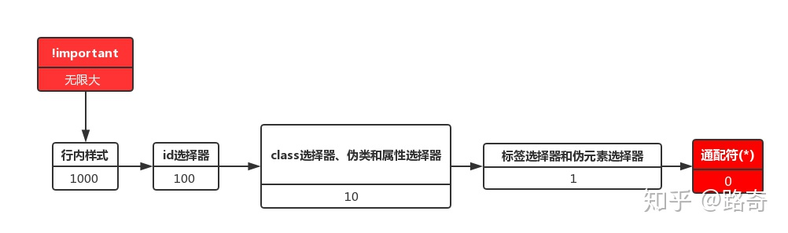

## 一、屏幕适配方案和优劣
[适配方案分析](https://juejin.cn/post/7163932925955112996#heading-1)

|  方案  |  实现方式  |  优点  |  缺点  |
|  ----  | ----  |----  |----  |
| vw vh	  | 1.按照设计稿的尺寸，将px按比例计算转为vw和vh |1.可以动态计算图表的宽高，字体等，灵活性较高 <br/> 2.当屏幕比例跟 ui 稿不一致时，不会出现两边留白情况 |1.每个图表都需要单独做字体、间距、位移的适配，比较麻烦 |
| scale | 1.通过 scale 属性，根据屏幕大小，对图表进行整体的等比缩放	| 1.代码量少，适配简单 <br/> 2.一次处理后不需要在各个图表中再去单独适配 | 1.因为是根据 ui 稿等比缩放，当大屏跟 ui 稿的比例不一样时，会出现周边留白情况 <br/> 2.当缩放比例过大时候，字体会有一点点模糊，就一点点 <br/> 3.当缩放比例过大时候，事件热区会偏移。 |
| rem + vw vh	 | 1.获得 rem 的基准值<br/>  2.动态的计算html根元素的font-size 3.图表中通过 vw vh 动态计算字体、间距、位移等 | 1.布局的自适应代码量少，适配简单	 | 1.因为是根据 ui 稿等比缩放，当大屏跟 ui 稿的比例不一样时，会出现周边留白情况<br/>  2.图表需要单个做字体、间距、位移的适配 |

## 1. 移动端1px线适配

使用 vw 适配屏幕大小方案，其中有一个缺点就是在 Retina 屏下，无法很好的展示真正的 1px 物理像素线条。

设计师想要的 retina 下 `border: 1px`，其实是 1 物理像素宽，而不是 1 CSS 像素宽度，对于 CSS 而言：

- 在 dpr = 1 时，此时 1 物理像素等于 1 CSS 像素宽度；
- 在 dpr = 2 时，此时 1 物理像素等于 0.5 CSS 宽度像素，可以认为 `border-width: 1px` 这里的 1px 其实是 1 CSS像素宽度，等于 2 像素物理宽度，设计师其实想要的是 `border-width: 0.5px`;
- 在 dpr = 3 时，此时 1 物理像素等于 0.33 CSS 宽度像素，设计师其实想要的是 `border: 0.333px`

然而，并不是所有手机浏览器都能识别 `border-width: 0.5px`，在 iOS7 以下，Android 等其他系统里，小于 1px 的单位会被当成为 0px 处理，那么如何实现这 0.5px、0.33px 呢？
这里介绍几种方法：

- 渐变实现： 使用两种颜色填充 1px 宽内容
- 使用css transform 缩放实现：对 1px 高度线条进行0.5/0.33倍缩放
- 使用图片实现（base64）：background-image 为一个base64 编码格式图片
- 使用SVG实现（嵌入 background url）：background-image 为一个svg 编码格式图片

[Retina 屏幕下 1px 线的实现](https://codepen.io/Chokcoco/pen/XyNjqK)

## 2. rem 适配方式
当初为了能让页面更好的适配各种不同的终端，通过Hack手段来根据设备的dpr值相应改变<meta>标签中viewport的值：
```html
<!-- dpr = 1-->
<meta name="viewport" content="initial-scale=scale,maximum-scale=scale,minimum-scale=scale,user-scalable=no"> 
<!-- dpr = 2-->
<meta name="viewport" content="initial-scale=0.5,maximum-scale=0.5,minimum-scale=0.5,user-scalable=no">
<!-- dpr = 3-->
<meta name="viewport" content="initial-scale=0.3333333333,maximum-scale=0.3333333333,minimum-scale=0.3333333333,user-scalable=no">
```
从而让页面达么缩放的效果，也变相的实现页面的适配功能。而其主要的思想有三点：

- 根据dpr的值来修改 viewport 实现1px的线
- 根据dpr的值来修改 html 的 font-size，从而使用rem实现等比缩放
- 使用Hack手段用rem模拟vw特性

rem 缺陷：
- 在宽度较大的设备上，整体缩放的太大了。而用户的预期应该是看到更多内容。你可以阅读这篇文章[《为什么2022年不建议你在小程序中用rpx》](https://juejin.cn/post/7128051145431318535)了解整体缩放的体验问题。
- 它的兼容性并不好，依然存在一些问题，尤其是尺寸遇到小数点时，bug较多。
- 开发天然喜欢px单位，像rem,em,vw，vh这些单位，一般都不是UI设计稿标注的尺寸，开发时需要转换成本。不如直接在代码中写px直观高效
- 兼容性更好的替代方案 viewport (vw)，几乎所有手机浏览器都支持viewport


## 二、vw、vh 适配方案
严格来说，使用 rem 进行页面适配其实是一种 hack 手段，rem 单位的初衷本身并不是用来进行移动端页面宽度适配的。

百分比适配方案的核心需要一个全局通用的基准单位，rem 是不错，但是需要借助 Javascript 进行动态修改根元素的 font-size，而 vw/vh（vmax/vmin） 的出现则很好弥补 rem 需要 JS 辅助的缺点。

根据相关的测试，可以使用 vw 进行长度单位的有：

- 容器大小适配，可以使用 vw
- 文本大小的适配，可以使用 vw
- 大于 1px 的边框、圆角、阴影都可以使用 vw
- 内距和外距，可以使用 vw

vw 优势：
- vw 也是一个相对单位(1vw = window.innerWidth * 1%)，不需要 js 辅助；
- postcss-px-to-viewport 自动转换插件，代码中写px 单位，打包后即可转化为 vw 单位；

vw 劣势：
- 没能很好的解决 1px 边框在高清屏下的显示问题，需要自行处理
- 由于 vw 方案是完全的等比缩放，在完全等比还原设计稿的同时带来的一个问题是无法很好的限定一个最大最小宽度值，由于 rem 方案是借助 Javascript 的，所以这一点 rem 比 vw 会更加的灵活(试想一下一个 750px 宽的设计稿在 1920px 的大屏显示器上的糟糕样子)

## 三、vw和rem结合适配，布局更优化

由于 vw 是利用视口单位实现的布局，依赖于视口大小而自动缩放，无论视口过大还是过小，它也随着视口过大或者过小，失去了最大最小宽度的限制。

为了修复这个问题，可以结合rem单位来实现布局， rem 弹性布局的核心在于动态改变根元素大小，可以通过：
- 给根元素大小设置随着视口变化而变化的 vw 单位，这样就可以实现动态改变其大小。

- 限制根元素字体大小的最大最小值，配合 body 加上最大宽度和最小宽度

这样我们就能够实现对布局宽度的最大最小限制。因此，根据以上条件，我们可以得出代码实现如下：
```scss
// rem 单位换算：定为 75px 只是方便运算，750px-75px、640-64px、1080px-108px，如此类推
$vw_fontsize: 75; // iPhone 6尺寸的根元素大小基准值
@function rem($px) {
     @return ($px / $vw_fontsize ) * 1rem;
}

// 根元素大小使用 vw 单位
$vw_design: 750;
html {
    font-size: ($vw_fontsize / ($vw_design / 2)) * 100vw; 
    // 同时，通过Media Queries 限制根元素最大最小值
    @media screen and (max-width: 320px) {
        font-size: 64px;
    }
    @media screen and (min-width: 540px) {
        font-size: 108px;
    }
}

// body 也增加最大最小宽度限制，避免默认100%宽度的 block 元素跟随 body 而过大过小
body {
    max-width: 540px;
    min-width: 320px;
}
```
优势：

1. 相对来说用户视觉体验更好，增加了最大最小宽度的限制；
2. 更重要是，如果选择主流的rem弹性布局方式作为项目开发的适配页面方法，这种做法更适合于后期项目从 rem 单位过渡到 vw 单位。只需要通过改变根元素大小的计算方式，你就可以不需要其他任何的处理，就无缝过渡到另一种CSS单位，更何况vw单位的使用必然会成为一种更好适配方式，目前它只是碍于兼容性的支持而得不到广泛的应用。

## 四、左侧宽度固定，右侧宽度自适应的布局

DOM结构

```html
<div class="box">
  <div class="box-left"></div>
  <div class="box-right"></div>
</div>
```

1. 利用 float + margin 实现
```css
.box {
 height: 200px;
}

.box > div {
  height: 100%;
}

.box-left {
  width: 200px;
  float: left;
  background-color: blue;
}

.box-right {
  margin-left: 200px;
  background-color: red;
}
```
2. 利用 calc 计算宽度

```css
.box {
 height: 200px;
}

.box > div {
  height: 100%;
}

.box-left {
  width: 200px;
  float: left;
  background-color: blue;
}

.box-right {
  width: calc(100% - 200px);
  float: right;
  background-color: red;
}
```
3. 利用 float + overflow 实现
```css
.box {
 height: 200px;
}

.box > div {
  height: 100%;
}

.box-left {
  width: 200px;
  float: left;
  background-color: blue;
}

.box-right {
  overflow: hidden;
  background-color: red;
}
```
4. 利用flex实现（flex-basic）
```css
.box {
  height: 200px;
  display: flex;
}

.box > div {
  height: 100%;
}

.box-left {
  width: 200px;
  background-color: blue;
}

.box-right {
  flex: 1; // 设置flex-grow属性为1，默认为0
  overflow: hidden;
  background-color: red;
}
```

## flex 布局：语法篇

阮一峰的网络日志： [Flex 布局教程：语法篇](http://www.ruanyifeng.com/blog/2015/07/flex-grammar.html)

## 五、css 选择器

阮一峰：[CSS选择器笔记](https://www.ruanyifeng.com/blog/2009/03/css_selectors.html)

## 六、css样式权重和优先级

权重记忆口诀：从0开始，一个行内样式+1000，一个id选择器+100，一个属性选择器、class或者伪类+10，一个元素选择器，或者伪元素+1，通配符+0。


1. 样式重复多写情况：后面的会覆盖前面的；
2. 不同的权重，权重值高则生效；
3. !important (提升样式优先级)，两种样式都使用 !important 时，权重值大的优先级更高；
5. 行内、内联和外联样式优先级，根据权重值来计算，行内样式的权重值最大；
6. 内联和外联样式优先级：内联样式和外联样式的优先级和加载顺序有关；
7. 权重相等的情况下：同等权重下，靠近目标的优先；