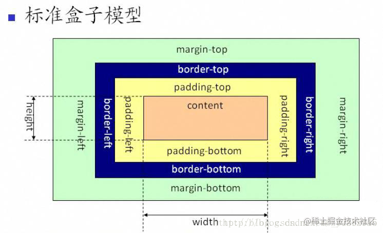
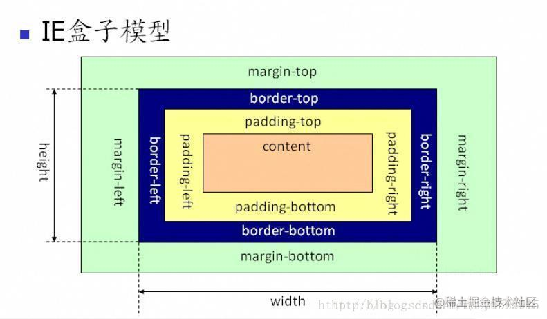
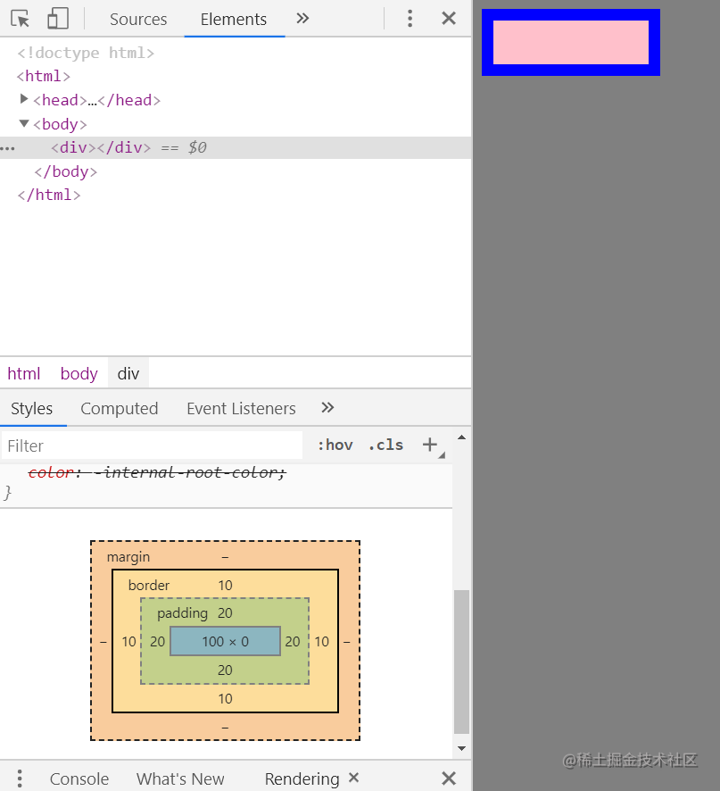
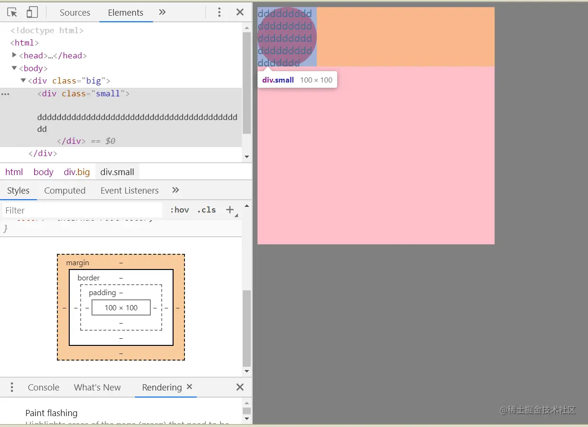
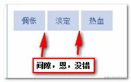
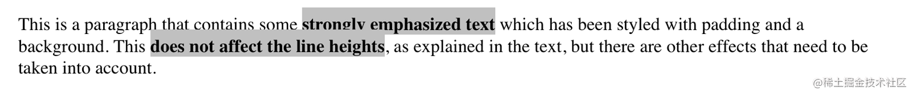
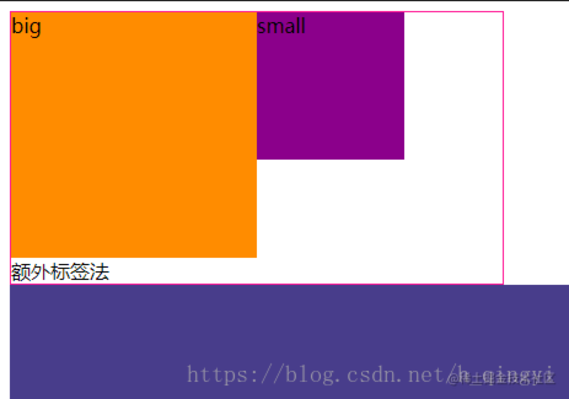

## 第一问：什么是盒模型？
可以说，页面就是由一个个盒模型堆砌起来的，每个HTML元素都可以叫做盒模型，盒模型由外而内包括：外边距（margin）、边框（border）、填充（亦称内边距）（padding）、内容（content）。它在页面中所占的实际宽度是margin + border + padding + content 的宽度相加。
但是，盒模型有**标准盒模型**和**IE的盒模型**。

## 第二问：两者的区别是什么？

### 标准的(W3C)盒模型：




## 第三问：怎么设置这两种模型呢？
很简单，通过设置 `box-sizing:content-box(W3C)/border-box(IE)` 就可以达到自由切换的效果。

## 第四问JS怎么获取和设置盒模型的宽高呢，你能想到几种方法？
- 第一种：`dom.style.width/height` 这种方法只能获取使用内联样式的元素的宽和高。
- 第二种： `dom.currentStyle.width/height` 这种方法获取的是浏览器渲染以后的元素的宽和高，无论是用何种方式引入的css样式都可以，但只有IE浏览器支持这种写法。
- 第三种：`window.getComputedStyle(dom).width/height` 这种方法获取的也是浏览器渲染以后的元素的宽和高，但这种写法兼容性更好一些。
- 第四种： `dom.getBoundingClientRect().width/height` 这种方法经常使用的场所是，计算一个元素的绝对位置（相对于视窗左上角），它能拿到元素的left、top、width、height 4个属性。

## 第五问：描述一下下面盒子的大小，颜色什么的（content-box模型）
```html
<html>
<style>
  body{
    background-color: gray;
  }
  div{
    color: blue;
    width: 100px;
    background-color: pink;
    border: 10px solid;
    padding: 20px;
  }
</style>
<body>
  <div></div>
</body>
</html>
```

这里不指考了一点，问题列一下：
- 整个盒子的大小
- padding的颜色
- border的颜色
- height为0了，看得见盒子吗？

答案：如图所示

- 整个盒子的大小 = 0 （因为height为0）
- padding的颜色 = pink（继承content的颜色）
- border的颜色 = blue（继承color字体的颜色，默认为black）
- height为0了，看得见盒子吗？ （虽然height为0，但是看得见盒子，因为有border和padding）

这里需要注意：
- 如果没有写border-style，那么边框的宽度不管设置成多少，都是无效的。
- border-color的颜色默认跟字体颜色相同
- padding颜色跟背景颜色相同

## 第六问：当small盒子设置成圆形时，内容会超出圆形吗？为什么
```html
<html>
<style>
  body{
    background-color: gray;
  }
  .big{
    width: 400px;
    height: 400px;
    background-color: pink;
  }
  .small{
    width: 100px;
    height: 100px;
    background-color: red;
    border-radius: 50%;
    overflow-wrap: break-word;
  }
</style>
<body>
  <div class="big">
    <div class="small">
      ddddddddddddddddddddddddddddddddddddddddddd
    </div>
  </div>
</body>
</html>
```

会超出圆形。原因如图所示，是因为border-radius只是改变视觉上的效果，实际上盒子占据的空间还是不变的。


## 第七问：当元素设置成inline-block会出现什么问题？怎么消除？

这是网易有道的小姐姐面试官的问题，我承认我确实不知道这个问题！
**真正意义上的inline-block水平呈现的元素间，换行显示或空格分隔的情况下会有间距，很简单的个例子：**
我们使用CSS更改非inline-block水平元素为inline-block水平，也会有该问题



```html
.space a {
    display: inline-block;
    padding: .5em 1em;
    background-color: #cad5eb;
}
<div class="space">
    <a href="##">惆怅</a>
    <a href="##">淡定</a>
    <a href="##">热血</a>
</div>
```

### 去除inline-block元素间间距的N种方法：
1. 元素间留白间距出现的原因就是**标签段之间的空格**，因此，去掉HTML中的空格，自然间距就木有了。考虑到代码可读性，显然连成一行的写法是不可取的，我们可以：
```html
<div class="space">
    <a href="##">
    惆怅</a><a href="##">
    淡定</a><a href="##">
    热血</a>
</div>
```
或者是：
```html
<div class="space">
    <a href="##">惆怅</a
    ><a href="##">淡定</a
    ><a href="##">热血</a>
</div>
```
或者是借助HTML注释：
```HTML
<div class="space">
    <a href="##">惆怅</a><!--
    --><a href="##">淡定</a><!--
    --><a href="##">热血</a>
</div>
```
2. 使用margin负值
3. 让闭合标签吃胶囊
4. 使用font-size:0
详细的可以看看这篇文章 [去除inline-block元素间间距的N种方法](http://www.zhangxinxu.com/wordpress/?p=2357)

## 第八问：行内元素可以设置padding，margin吗？
- 第一：行内元素与宽度 宽度不起作用
```css
span {
  width:200px;
}
```
没有变化
第二：行内元素与高度 高度不起作用
```css
span{
  height:200px;
}
```
没用变化

第三：行内元素与padding,margin
```css
span{
  padding:200px;
}
```
影响左右，不影响上下 ,span包裹的文字左右位置改变，上下位置不变，但背景色会覆盖上面元素的内容。 如图所示：

**行内元素（inline-block）的padding左右有效 ，但是由于设置padding上下不占页面空间，无法显示效果，所以无效。**


## 第九问：padding:1px2px3px;则等效于什么？

简单来说就是 这四个值，分别代表上、右、下、左。如果没有写下的话，那就下复制上的，同理左复制右的值。
因此， 你应该明白了

- 当padding的值只有一个时，就是后面三个都复制了第一个
- 当写两个时，就是写了top和right，因此bottom复制top，left复制right
- 当写了三个时，就是写了top，right，bottom，因此left复制right。

这么简单的规则，再也不会忘记了吧。

## 第十问：内边距的百分数值是这么计算的

我们知道，padding可以这么设置：`padding:100px`，也可以 `padding:20%`，那当是百分比时是怎么计算的呢？就是根据父元素的宽度计算的；

## 第十一问：那为什么不根据自己的宽度呢？而要根据父元素

这个问题可以这么思考，如果不根据父元素，而是根据本身的宽度的话。那么当padding生效后，本身的宽度不就变大了吗？那么padding不是也要变大吗？这就陷入了死循环（哇塞！）。
或者要是本身没有宽度，那岂不是怎么设置padding都是无效的！！！

## 第十二问：什么是边距重叠？什么情况下会发生边距重叠？如何解决边距重叠？
边距重叠：两个box如果都设置了边距，那么在垂直方向上，两个box的边距会发生重叠，以绝对值大的那个为最终结果显示在页面上。
边距重叠分为两种：

1. 同级关系的重叠：
> 同级元素在垂直方向上外边距会出现重叠情况，最后外边距的大小取两者绝对值大的那个**

```html
<section class="fat">
  <style type="text/css">
      .fat {
          background-color: #ccc;
      }
      .fat .child-one {
          width: 100px;
          height: 100px;
          margin-bottom: 30px;
          background-color: #f00;
      }

      .fat .child-two {
          width: 100px;
          height: 100px;
          margin-top: 10px;
          background-color: #345890;
      }
  </style>
  <div class="child-one"></div>
  <div class="child-two"></div>
</section>
```

2. 父子关系的边距重叠：
> 父子关系，如果子元素设置了外边距，在没有把父元素变成BFC的情况下，父元素也会产生外边距。

给父元素添加 `overflow：hidden` 这样父元素就变为 BFC，不会随子元素产生外边距，但是父元素的高会变化

```html
<section class="box" id="fat">
  <style type="text/css">
      #fat {
          background-color: #f00;
          overflow: hidden;
      }

      #fat .child {
          margin-top: 10px;
          height: 100px;
          background-color: blue;
      }   
  </style>
  <article class="child"></article>
</section>
```
## 第十三问：第二种哪里算是外边距重叠？？？

实际上，这也是第一种的变形。

```html
header {
  background: goldenrod;
}
h1 {
  margin: 1em;
}
<header>
  <h1>Welcome to ConHugeCo</h1>
</header>
```
!(css)[./CSS盒模型/css面试4.png]

可以看到其实是header的margin为0，然后h1的margin为1em，因此header和h1的margin发生了重叠，然后header的margin就取1em和0两个值中最大的值了，所以当然取1em啦。

> （网上有说是因为margin的传递性，但我并不同意，因为我实践了一下，发现不管父盒子有没有margin-top，父盒子只会选择两者值中的最大值，跟传递性似乎没啥关系）

## 第十四问：为什么回出现margin重叠的问题？粗俗点就是问设计者的脑子有问题吗？
这个就是问设计了margin重叠的巧妙用处。
这个曾经有位面试官问过我，我不知道，我请教了他，他说，在flex布局前，要实`justify-content： space-evenly`的效果，利用浮动布局，然后给每个盒子设置`margin-right`，`margin-left`就可以实现了，这样就不用去单独地再去设置第一个盒子的`margin-left`和最后一个盒子的`margin-right`，那时候我信了。
后来越想越不对，不是说margin水平方向不会发生重叠问题吗？？？？
但是根据面试官的思路来的话，在垂直方向似乎就讲的通了。
```html
<html>
<style>
  body{
    background-color: gray;
  }
  ul{
    width: 300px;
    height: 170px;
    background-color: blue;
    border: 1px solid;
  }
  li{
    margin-top: 20px;
    margin-bottom: 20px;
    width: 40px;
    height: 30px;
    background-color: orange;
  }
</style>
<body>
  <ul>
    <li></li>
    <li></li>
    <li></li>
  </ul>
</body>
</html>
```
!(css)[./CSS盒模型/css面试5.png]

或许你有更好的说法，欢迎下方留言评论补充！！！
**那该怎么解决margin边距重叠的问题呢？**
解决方法就是生成BFC
## 第十五问：什么是BFC？
BFC的基本概念–BFC就是“**块级格式化上下文**”的意思，也有译作“块级格式化范围”。它是 W3C CSS 2.1 规范中的一个概念，它决定了元素如何对其内容进行定位，以及与其他元素的关系和相互作用。通俗的讲，就是一个特殊的块，内部有自己的布局方式，不受外边元素的影响。
## 第十六问：那么BFC的原理是什么呢？

1. 内部的Box会在垂直方向上一个接一个的放置
2. 垂直方向上的距离由margin决定。（完整的说法是：属于同一个BFC的两个相邻Box的margin会发生重叠（塌陷），与方向无关。）
3. 每个元素的左外边距与包含块的左边界相接触（从左向右），即使浮动元素也是如此。（这说明BFC中子元素不会超出他的包含块，而position为absolute的元素可以超出他的包含块边界）
4. BFC的区域不会与float的元素区域重叠
5. 计算BFC的高度时，浮动子元素也参与计算
6. BFC就是页面上的一个隔离的独立容器，容器里面的子元素不会影响到外面元素，反之亦然

## 第十七问：BFC由什么条件创立?

1. float属性不为none
2. position属性为absolute或fixed
3. display属性为inline-block、table-cell、table-caption、flex、inline-flex
4. overflow属性不为visible（- overflow: auto/ hidden;）

~~总结：pdfo~~
## 第十八问： BFC的使用场景有哪些呢

1. 可以用来自适应布局。
```html
<!-- BFC不与float重叠 -->
<section id="layout">
    <style media="screen">
      #layout{
        background: red;
      }
      #layout .left{
        float: left;
        width: 100px;
        height: 100px;
        background: #664664;
      }
      #layout .right{
        height: 110px;
        background: #ccc;
        overflow: auto;
      }
    </style>
    <div class="left"></div>
    <div class="right"></div>
    <!-- 利用BFC的这一个原理就可以实现两栏布局，左边定宽，右边自适应。不会相互影响，哪怕高度不相等。 -->
</section>
```

2. 可以清除浮动：（塌陷问题）
```html
<!-- BFC子元素即使是float也会参与计算 -->
<section id="float">
    <style media="screen">
      #float{
        background: #434343;
        overflow: auto;
      }
      #float .float{
        float: left;
        font-size: 30px;
      }
    </style>
    <div class="float">我是浮动元素</div>
</section>
```


3. 解决垂直边距重叠：
```html
<section id="margin">
    <style>
        #margin{
            background: pink;
            overflow: hidden;
        }
        #margin>p{
            margin: 5px auto 25px;
            background: red;
        }
        #margin>div>p {
            margin: 5px auto 20px;
            background: red;
        }
    </style>
    <p>1</p>
    <div style="overflow:hidden">
        <p>2</p>
    </div>
    <p>3</p>
    <!-- 这样就会出现第一个p标签的margin-bottom不会和第二个p标签的margin-top重叠，这也是BFC元素的另一个原则，不会影响到外边的box，是一个独立的区域。 -->
</section>
```
## 第十九问：清除浮动的方法（最常用的4种）
这时候很多人会想到新建标签clear：both和float 方法，但是这两种方法并不推荐使用！
什么是clear：both
clear：both：本质就是闭合浮动， 就是让父盒子闭合出口和入口，不让子盒子出来

1. 额外标签法（在最后一个浮动标签后，新加一个标签，给其设置clear：both；）（不推荐）
```html
<!DOCTYPE html>
<html lang="en">
<head>
    <meta charset="UTF-8">
    <meta name="viewport" content="width=device-width, initial-scale=1.0">
    <meta http-equiv="X-UA-Compatible" content="ie=edge">
    <title>Document</title>
    <style>
    .fahter{
        width: 400px;
        border: 1px solid deeppink;
    }
    .big{
        width: 200px;
        height: 200px;
        background: darkorange;
        float: left;
    }
    .small{
        width: 120px;
        height: 120px;
        background: darkmagenta;
        float: left;
    }
    .footer{
        width: 900px;
        height: 100px;
        background: darkslateblue;
    }
    .clear{
        clear:both;
    }
    </style>
</head>
<body>
    <div class="fahter">
        <div class="big">big</div>
        <div class="small">small</div>
        <div class="clear">额外标签法</div>
    </div>
    <div class="footer"></div>
</body>
</html>
```

如果我们清除了浮动，父元素自动检测子盒子最高的高度，然后与其同高。

优点：通俗易懂，方便

缺点：添加无意义标签，语义化差
不建议使用。

2. 父级添加overflow属性（父元素添加overflow:hidden）（不推荐）

通过触发BFC方式，实现清除浮动
```css
.fahter{
    width: 400px;
    border: 1px solid deeppink;
    overflow: hidden;
}
```

优点：代码简洁

缺点：内容增多的时候容易造成不会自动换行导致内容被隐藏掉，无法显示要溢出的元素

不推荐使用

3. 使用after伪元素清除浮动（推荐使用）
```html
.clearfix:after{/*伪元素是行内元素 正常浏览器清除浮动方法*/
    content: "";
    display: block;
    height: 0;
    clear:both;
    visibility: hidden;
}
.clearfix{
    *zoom: 1;/*ie6清除浮动的方式 *号只有IE6-IE7执行，其他浏览器不执行*/
}
 
<body>
    <div class="fahter clearfix">
        <div class="big">big</div>
        <div class="small">small</div>
        <!--<div class="clear">额外标签法</div>-->
    </div>
    <div class="footer"></div>
</body>
```
优点：符合闭合浮动思想，结构语义化正确

缺点：ie6-7不支持伪元素：after，使用zoom:1 触发 hasLayout.

推荐使用

4. 使用before和after双伪元素清除浮动
```html
 .clearfix:after,.clearfix:before{
    content: "";
    display: table;
}
.clearfix:after{
    clear: both;
}
.clearfix{
    *zoom: 1;
}
 
 <div class="fahter clearfix">
        <div class="big">big</div>
        <div class="small">small</div>
    </div>

 <div class="footer"></div>
```
优点：代码更简洁

缺点：用zoom:1触发hasLayout.

推荐使用

5. 浮动父元素

```html

img{
  width:50px;
  border:1px solid #8e8e8e;
  float:left;
}
<div style="float:left">
  
  
  
  
</div>
```
这种方式也不推荐，了解即可。


### 参考链接：https://juejin.cn/post/6880111680153059341