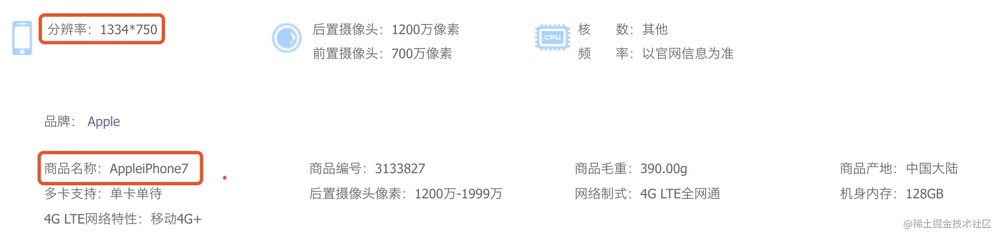
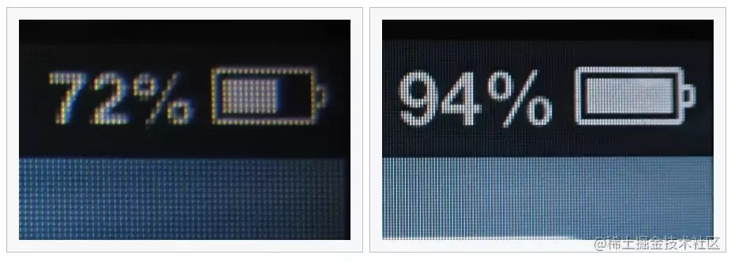
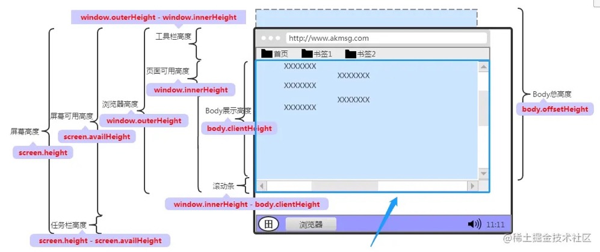
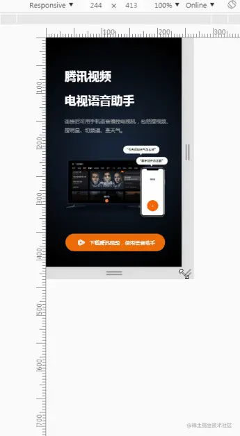
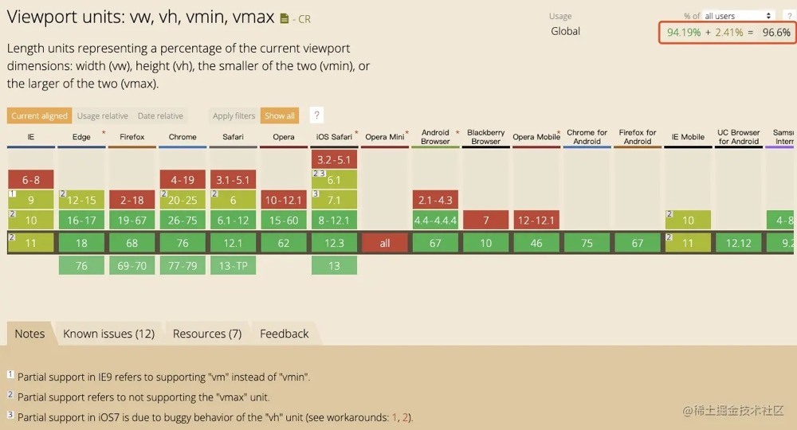

## 移动端适配要点
- 媒体查询，边界断点的规则设定（Media queries && break point）
- 内容的可伸缩性效果（Flexibel visuals）
- 流式网格布局(Fluid grids)
- 主要内容呈现及图片的高质量(Main content and high quality)

## 移动端屏幕适配方案
通常而言，设计师只会给出单一分辨率下的设计稿，而我们要做的，就是以这个设计稿为基准，去适配所有不同大小的移动端设备。

### 1. 一些基础概念

- 设备独立像素
以 iPhone6/7/8为例，这里我们打开 Chrome 开发者工具：


这里的 `375 * 667` 表示的是什么呢，表示的是**设备独立像素（DIP）**，也可以理解为 **CSS 像素**，也称为**逻辑像素**：

**设备独立像素 = CSS 像素 = 逻辑像素**

- 物理像素

OK，那么，什么又是物理像素呢。我们到电商网站购买手机，都会看一看手机的参数，以 JD 上的 iPhone7 为例：


可以看到，iPhone7 的分辨率是 `1334 x 750`，这里描述的就是**屏幕实际的物理像素**。
**物理像素**，又称为**设备像素**。显示屏是由一个个物理像素点组成的，`1334 x 750` 表示手机分别在垂直和水平上所具有的像素点数。通过控制每个像素点的颜色，就可以使屏幕显示出不同的图像，屏幕从工厂出来那天起，它上面的物理像素点就固定不变了，单位为`pt`。
**设备像素 = 物理像素**

- DPR（Device Pixel Ratio） 设备像素比

OK，有了上面两个概念，就可以顺理成章引出下一个概念：**DPR（Device Pixel Ratio） 设备像素比**，这个与我们通常说的**视网膜屏（多倍屏，Retina屏）**有关。

设备像素比描述的是未缩放状态下，物理像素和设备独立像素的初始比例关系。

简单的计算公式：

**DPR = 物理像素 / 设备独立像素**

我们套用一下上面 iPhone7 的数据（取设备的物理像素宽度与设备独立像素宽度进行计算）：

iPhone7’s DPR = iPhone7’s 物理像素宽度 / iPhone7's 设备独立像素宽度 = 2

> 750 / 375 = 2 或者是 1334 / 667 = 2

可以得到 iPhone7 的 dpr 为 2。也就是我们常说的视网膜屏幕。

> 视网膜（Retina）屏幕是苹果公司"发明"的一个营销术语。 苹果公司将 dpr > 1 的屏幕称为视网膜屏幕。

在视网膜屏幕中，以 dpr = 2 为例，把 4(2x2) 个像素当 1 个像素使用，这样让屏幕看起来更精致，但是元素的大小本身却不会改变：



OK，到这里我们就完成了一个小的里程碑。我们通常说的H5手机适配也就是指的这两个维度：

1. 适配不同屏幕大小，也就是适配不同屏幕下的 CSS 像素
2. 适配不同像素密度，也就是适配不同屏幕下 dpr 不一致导致的一些问题

### 2. 适配不同屏幕大小
适配不同屏幕大小，也就是适配不同屏幕下的 CSS 像素。最早移动端屏幕 CSS 像素适配方案是**CSS媒体查询**。但是无法做到高保真接近 100% 的还原。
适配不同屏幕大小其实只需要遵循一条原则，确保页面元素大小的与屏幕大小保持一定比例。也就是：按比例还原设计稿

以页面宽度为基准的话，那么，

- 元素的宽度为：`209/375 = 55.73%`
- 元素的高度为：`80/375 = 21.33%`
- 元素的上左右边距依次计算...

这样，无论屏幕的 CSS 像素宽度是 320px 还是 375px 还是 414px，按照等量百分比还原出来的界面总是正确的。

然而，理想很丰满，现实很骨感。实现上述百分比方案的核心需要一个全局通用的基准单位，让所有百分比展示以它为基准，但是在 CSS 中，根据[CSS Values and Units Module Level 4](https://www.w3.org/TR/css-values-4/#percentages)的定义：

> 百分比值总要相对于另一个量，比如长度。每个允许使用百分比值的属性，同时也要定义百分比值参照的那个量。这个量可以是相同元素的另一个属性的值，也可以是祖先元素的某个属性的值，甚至是格式化上下文的一个度量（比如包含块的宽度）。

具体来说：

- 宽度（width）、间距（maring/padding）支持百分比值，但默认的相对参考值是包含块的宽度；
- 高度（height）百分比的大小是相对其父级元素高的大小；
- 边框（border）**不支持**百分值；
- 边框圆角半径（border-radius）支持百分比值，但水平方向相对参考值是盒子的宽度，垂直方向相对参考值是盒子的高度；
- 文本大小（font-size）支持百分比值，但相对参考值是**父元素的font-size**的值；
- 盒阴影（box-shadow）和文本阴影（text-shadow）**不支持**百分比值；

首先，支持百分比单位的度量属性有其各自的参照基准，其次并非所有度量属性都支持百分比单位。所以我们需要另辟蹊径。

#### rem 适配方案
在 vw 方案出来之前，最被大众接受的就是使用 rem 进行适配的方案，因为 rem 满足上面说的，可以是一个全局性的基准单位。

> rem（font size of the root element），在 CSS Values and Units Module Level 3中的定义就是， 根据网页的根元素来设置字体大小，和 em（font size of the element）的区别是，em 是根据其父元素的字体大小来设置，而 rem 是根据网页的跟元素（html）来设置字体大小。

#### flexible
基于此，淘宝早年推行的一套以 rem 为基准的适配方案：[lib-flexible](https://github.com/amfe/lib-flexible)。其核心做法在于：

- ~~根据设备的 dpr 动态改写 <meta> 标签，设置 viewport 的缩放~~
- ~~给 `<html>` 元素添加 `data-dpr` 属性，并且动态改写 `data-dpr` 的值~~
- 根据 `document.documentElement.clientWidth` 动态修改 `<html>` 的 font-size ，页面其他元素使用 rem 作为长度单位进行布局，从而实现页面的等比缩放

> 关于头两点，其实现在的 `lib-flexible` 库已经不这样做了，不再去缩放 Viewport，字体大小的设定也直接使用了 rem

#### hotcss
[hotcss](https://github.com/imochen/hotcss) 不是一个库，也不是一个框架。它是一个移动端布局开发解决方案。使用 hotcss 可以让移动端布局开发更容易。本质的思想与 flexible 完全一致。

#### 对于 rem 方案的一些总结

使用 flexible/hotcss 作为屏幕宽度适配解决方案，是存在一些问题的：

- 动态修改 Viewport 存在一定的风险的，譬如通过 Viewport 改变了页面的缩放之后，获取到的 innerWidth/innerHeight 也会随之发生变化，如果业务逻辑有获取此类高宽进行其他计算的，可能会导致意想不到的错误；
> 到今天，其实存在很多在 flexible 基础上演化而来的各种 rem 解决方案，有的不会对 Viewport 进行缩放处理，自行处理 1px 边框问题。

- flexible/hotcss 都并非纯 CSS 方案，需要引入一定的 Javascript 代码
- rem 的设计初衷并非是用于解决此类问题，用 rem 进行页面的宽度适配多少有一种 hack 的感觉
- 存在一定的兼容性问题，对于安卓 4.4 以下版本系统不支持 viewport 缩放（当然，flexible 处理 Android 系列时，始终认为其 dpr 为 1，没有进行 viewport 缩放）

### vw 适配方案
严格来说，使用 rem 进行页面适配其实是一种 hack 手段，rem 单位的初衷本身并不是用来进行移动端页面宽度适配的。

到了今天，有了一种更好的替代方案，使用 vw 进行适配 。

百分比适配方案的核心需要一个全局通用的基准单位，rem 是不错，但是需要借助 Javascript 进行动态修改根元素的 font-size，而 vw/vh（vmax/vmin） 的出现则很好弥补 rem 需要 JS 辅助的缺点。

根据 CSS Values and Units Module Level 4：`vw` 等于初始包含块（html元素）宽度的1%，也就是

- `1vw` 等于 `window.innerWidth` 的数值的 1%
- `1vh` 等于 `window.innerHeight` 的数值的 1%



再以上面设计稿图的元素为例，那么，

- 元素的宽度为：209/375 = 55.73% = 55.73vw
- 元素的高度为：80/375 = 21.33% = 21.33vw
- 元素的上左右边距依次计算...

根据相关的测试，可以使用 vw 进行长度单位的有：

- 容器大小适配，可以使用 vw
- 文本大小的适配，可以使用 vw
- 大于 1px 的边框、圆角、阴影都可以使用 vw
- 内距和外距，可以使用 vw

简单的一个页面，看看效果，完全是等比例缩放的效果：



[CodePen Demo（移动端打开）：使用 vw 进行页面适配](https://codepen.io/Chokcoco/pen/oNvWVYq?editors=0010)

### 自动转换插件
当我们使用 rem 作为长度单位的时，通常会有借助 Sass/Less 实现一个转换函数，像是这样：

```less
// 假设设计稿的宽度是 375px，假设取设计稿宽度下 1rem = 100px
$baseFontSize: 100;

@function px2rem($px) {
	@return $px / $baseFontSize * 1rem;
}
```
同理，在 vw 方案下，我们只需要去改写这个方法：

```less
// 假设设计稿的宽度是 375px
@function px2vw($px) {
	@return $px / 375 * 100vw;
}
```

当然，我们还可以借助一些插件包去实现这个自动转换，提高效率，譬如 [postcss-px-to-viewport](https://www.npmjs.com/package/postcss-px-to-viewport)

### vw polyfill
vw 现在毕竟还是存在兼容问题的，看看兼容性：

其实已经覆盖了绝大部分设备，那么如果业务使用了且又真的出现了兼容问题，应该怎么处理呢？有两种方式可以进行降级处理：

- CSS Houdini：通过CSS Houdini针对vw做处理，调用CSS Typed OM Level1 提供的 CSSUnitValue API。
- CSS Polyfill：通过相应的Polyfill做相应的处理，目前针对于 vw 单位的 Polyfill 主要有：vminpoly、Viewport Units Buggyfill、vunits.js和 Modernizr

### 对于 vw 方案的一些总结
vw 确实看上去很不错，但是也是存在它的一些问题：

- 也没能很好的解决 1px 边框在高清屏下的显示问题，需要自行处理
- 由于 vw 方案是完全的等比缩放，在完全等比还原设计稿的同时带来的一个问题是无法很好的限定一个最大最小宽度值，由于 rem 方案是借助 Javascript 的，所以这一点 rem 比 vw 会更加的灵活

当然，两个方案现阶段其实都可以使用甚至一起搭配使用，更多详情可以读读：
- [再聊移动端页面的适配](https://juejin.cn/post/6844903552578486285)
- [H5必知必会之像素级还原设计稿](https://mp.weixin.qq.com/s?__biz=Mzg4MTYwMzY1Mw==&mid=2247496079&idx=1&sn=04bfe9d98709f38540f71f37651707a8&source=41#wechat_redirect)
- [Responsive And Fluid Typography With vh And vw Units](https://www.smashingmagazine.com/2016/05/fluid-typography/)
- [使用VH和VW实现真正的流体排版](https://www.cnblogs.com/wengxuesong/archive/2016/05/16/5497653.html)
### 参考文章：
- [前端基础知识概述 -- 移动端开发的屏幕、图像、字体与布局的兼容适配](https://juejin.cn/post/6844903935568789517)