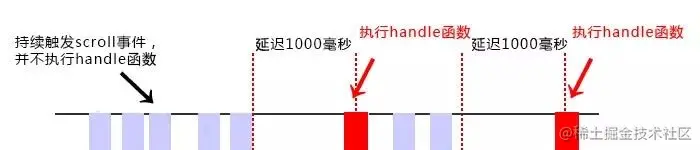
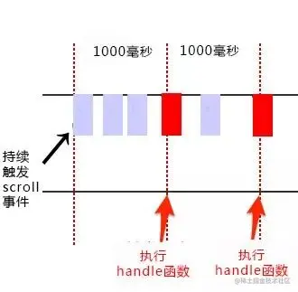

## 防抖与节流

### 防抖 debounce
1. 定义

> 在事件被触发n秒后再执行回调，如果在这n秒内又被触发，则重新计时。（延迟执行，重复触发时，取消上一个计时，重新开始倒计时）



2. 适用场景
- 窗口的resize、scroll
- 输入框内容校验

3. 实现
```js
function debounce(fun, delay) {
  return function (args) {
    let that = this
    let _args = args
    clearTimeout(fun.id)
    fun.id = setTimeout(function () {
        fun.call(that, _args)
    }, delay)
  }
}
// 使用方法
let inputb = document.getElementById('debounce')

let debounceAjax = debounce(ajax, 500)

inputb.addEventListener('keyup', function (e) {
    debounceAjax(e.target.value)
})

```
### 节流
1. 定义

> 规定在一个单位时间内，只能触发一次函数。如果这个单位时间内触发多次函数，只有一次生效。（以固定频率执行）



2. 适用场景
- 鼠标不断点击触发，mousedown(单位时间内只触发一次)
- 监听滚动事件，比如是否滑到底部自动加载更多，用throttle来判断

3. 实现
```js
function throttle(fun, delay) {
  let last, deferTimer
  return function () {
    let that = this;
    let _args = arguments;
    let now = Date.now();
    if (last && now < last + delay) {
        clearTimeout(deferTimer);
        deferTimer = setTimeout(function () {
            last = now;
            fun.apply(that, _args);
        }, delay);
    } else {
        last = now;
        fun.apply(that, _args);
    }
  }
}

// 使用方式
let throttleAjax = throttle(ajax, 1000)

let inputc = document.getElementById('throttle')
inputc.addEventListener('keyup', function(e) {
    throttleAjax(e.target.value)
});
```
## defer 与 async
defer 和 async 在网络读取（下载脚本）时行为类似，均是异步的（相较于 HTML 解析）
两者区别在于：

1. 脚本异步下载完之后执行的时机：defer 会在**所有文档元素解析完成后，DOMContentLoaded 事件触发之前执行**；async 会在**脚本异步下载完成后立刻执行**。
2. 脚本异步下载完之后的加载顺序：defer 按照脚本**开始下载的顺序执行脚本**；async 则是**下载完后就执行，是乱序执行**，因为 async 脚本的加载和执行是紧挨着执行的，因此哪个脚本先加载完成就会先执行哪个。

> defer 按照脚本声明顺序执行，async 按照脚本加载完成的先后顺序执行。

async 对于应用脚本的用处不大，因为它完全不考虑依赖（哪怕是最低级的顺序执行），不过它对于那些可以不依赖任何脚本或不被任何脚本依赖的脚本来说却是非常合适的。

## requestAnimationFrame
1. 定义：告知浏览器在**下一次重绘前，调用其回调函数**来更新动画。
2. 内部执行机制：
  - 首先判断 `document.hidden` 属性是否可见（true），可见状态下才能继续执行以下步骤。
  - 浏览器**清空**回调队列中的动画函数。
  - `requestAnimationFrame() `将回调函数追加到**动画帧请求回调函数列表**的末尾。
>注意：执行 `requestAnimationFrame(callback)` 不会立即调用 callback 回调函数，只是将其放入**动画帧请求回调函数队列**(不知道是不是浏览器维护回流/重绘操作的队列？总之该队列是与宏任务/微任务等回调队列独立开的)而已，同时注意，每个 callback回调函数都有一个 cancelled 标志符，初始值为 false，并对外不可见。
  - 当页面可见并且动画帧请求callback回调函数列表不为空时，浏览器会定期将这些回调函数加入到浏览器 UI 线程的队列中（由系统来决定回调函数的执行时机）。

> 当浏览器执行这些 callback 回调函数的时候，会判断每个元组的 callback 的cancelled标志符，只有 cancelled 为 false 时，才执行callback回调函数(若被 `cancelAnimationFrame()` 取消了，对应 callback 的 cancelled 标识符会被置为 true)。

## 特点：
### 1. 定时动画存在的问题
- setTimeout / setInterval 不能保证回调的运行时刻：计时器只能保证何时将回调添加至浏览器的回调队列(宏任务)，不能保证回调队列的运行时间，假设主线程被其他任务占用，那么回调队列中的动画任务就会被阻塞，而不会按照原定的时间间隔刷新绘制。
- setTimeout / setInterval 计时不精确：不同浏览器的计时器精度都存在误差，此外浏览器会对切换到后台或不活跃标签页中的计时器进行限流，导致计时器计时误差。
- setTimeout / setInterval 在后台运行增大 CPU 开销：当标签页处于非活跃状态，计时器仍在执行计时工作，同时刷新动画效果，增大了 CPU 开销。(现阶段浏览器对此做了优化，如 FireFox/Chrome 浏览器对定时器做了优化：页面闲置时，如果时间间隔小于 1000ms，则停止定时器，与requestAnimationFrame行为类似。如果时间间隔>=1000ms，定时器依然在后台执行)

### 2. requestAnimationFrame 动画刷新机制的特点

- requestAnimationFrame 采用系统时间间隔来执行回调函数，保持最佳绘制效率，不会因为间隔时间的过短，造成过度绘制，增加页面开销，也不会因为间隔时间过长，造成动画卡顿，不流程，影响页面美观。

> requestAnimationFrame的基本思想：让页面重绘的频率和刷新频率保持同步，即每 1000ms / 60 = 16.7ms执行一次。由于每次执行动画帧回调是由浏览器重回频率决定的，因此不需要像 setTimeout 那样传递时间间隔，而是浏览器通过系统获取并使用显示器刷新频率。

- requestAnimationFrame 自带节流功能，例如在某些高频事件（resize，scroll 等）中，requestAnimationFrame 依据系统时间间隔来调用回调，可以防止在一个刷新间隔内发生多次函数执行。
- requestAnimationFrame 延时效果是精确的，即在每次页面重绘前必会清空一次动画帧回调队列。(setTimeout 任务被放进异步队列中，只有当主线程上的任务执行完以后，才会去检查该队列的任务是否需要开始执行，造成时间延时)。
- requestAnimationFrame 会把每一帧中的所有DOM操作集中起来，在一次重绘或回流中完成。
- setTimeout 的执行只是在内存中对图像属性进行改变，这个改变必须要等到下次浏览器重绘时才会被更新到屏幕上。如果和屏幕刷新步调不一致，就可能导致中间某些帧的操作被跨越过去，直接更新下下一帧的图像，即掉帧。使用 requestAnimationFrame 执行动画，最大优势是能保证动画帧回调队列中的回调函数在屏幕每一次刷新前都被执行一次，然后将结果一起重绘到浏览器页面，这样就不会引起丢帧，动画也就不会卡顿。
- requestAnimationFrame() 只有当标签页处于活跃状态是才会执行，当页面隐藏或最小化时，会被暂停，页面显示，会继续执行，节省了 CPU 开销。早期浏览器会对切换至后台或不活跃的标签页中的计时器执行限流，导致计时器时间不精确，此外计时器在后台仍会进行计时工作，执行动画任务，此时刷新动画是完全没有意义的。