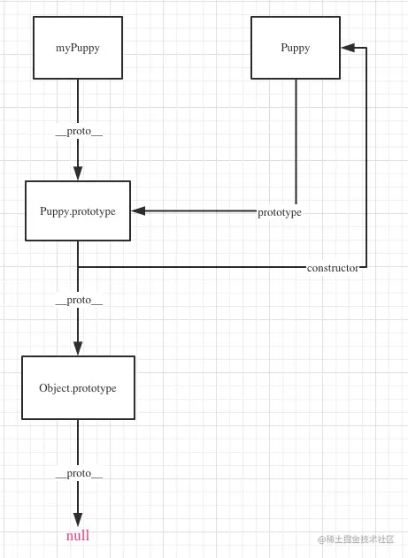

# JS 面向对象、prototype 和 \_\_proto\_\_

## prototype 和 \_\_proto\_\_ 由来

1. 没有class 关键字，使用函数代替

早期的 js 并没有 class 关键字，所以使用 js 函数替代，实现面向对象的能力；
```js
// 构造函数
function Puppy() {}

// 实例化
var myPuppy = new Puppy();
```
但这样的设计缺少了构造函数，无法在构造函数中对实例做特殊配置，如上面例子中无法设置 `myPuppy` 的年龄；
## 函数本身就是构造函数

当做类用的函数本身也是一个函数，而且他就是默认的构造函数。我们想让Puppy函数能够设置实例的年龄，只要让他接收参数就行了。
```js
function Puppy(age) {
  this.puppyAge = age;
}

// 实例化时可以传年龄参数了
const myPuppy = new Puppy(2);
```
注意上面代码的this，被作为类使用的函数里面this总是指向实例化对象，也就是myPuppy。这么设计的目的就是让使用者可以通过构造函数给实例对象设置属性，这时候console出来看myPuppy.puppyAge就是2。

```js
console.log(myPuppy.puppyAge);   // 输出是 2
```
## 实例方法用prototype

上面我们实现了类和构造函数，但是类方法呢？Java版小狗还可以“汪汪汪”叫呢，JS版怎么办呢？JS给出的解决方案是给方法添加一个**prototype**属性，挂载在这上面的方法，在实例化的时候会给到实例对象。我们想要`myPuppy`能说话，就需要往`Puppy.prototype`添加说话的方法。
```js
Puppy.prototype.say = function() {
  console.log("汪汪汪");
}
```
## 实例方法查找用\_\_proto\_\_

实例对象上并不存在构造函数上的方法，在查找对应的方法的时候，就需要使用 `__proto__`，当访问一个对象上没有的属性时，比如 `myPuppy.say`，对象会去`__proto__`查找。`__proto__`的值就等于父类的`prototype`, `myPuppy.__proto__`指向了`Puppy.prototype`

```js
myPuppy.__proto__ === Puppy.prototype
```
如果你访问的属性在`Puppy.prototype`也不存在，那又会继续往`Puppy.prototype.__proto__`上找，这时候其实就找到了`Object.prototype`了，`Object.prototype`再往上找就没有了，也就是 `null`，这其实就是**原型链**。

## constructor
我们说的`constructor`一般指类的`prototype.constructor`。`prototype.constructor`是`prototype`上的一个保留属性，这个属性就指向**类函数本身**，用于指示当前类的**构造函数**。

```js
Puppy.prototype.constructor = Puppy
```

既然`prototype.constructor`是指向构造函数的一个指针，那我们是不是可以通过它来修改构造函数呢？我们来试试就知道了。我们先修改下这个函数，然后新建一个实例看看效果：

```js
function Puppy(age) {
  this.puppyAge = age;
}

Puppy.prototype.constructor = function myConstructor(age) {
  this.puppyAge = age + 1;
}

const myPuppy2 = new Puppy(2);
console.log(myPuppy2.puppyAge);    // 输出是2
```
通过下面一张图来描述三者的关系：


## 实现一个new
结合上面讲的， new其实就是生成了一个对象，这个对象能够访问类的原型，知道了原理，我们就可以自己实现一个new了。

```js
function myNew(func, ...args) {
  const obj = {};     // 1. 新建一个空对象
  const result = func.call(obj, ...args);  // 2. 执行构造函数
  obj.__proto__ = func.prototype;    // 3.设置原型链

  // 4. 注意如果原构造函数有Object类型的返回值，包括Functoin, Array, Date, RegExg, Error
  // 那么应该返回这个返回值
  const isObject = typeof result === 'object' && result !== null;
  const isFunction = typeof result === 'function';
  if(isObject || isFunction) {
    return result;
  }

  // 原构造函数没有Object类型的返回值，返回我们的新对象
  return obj;
}

function Puppy(age) {
  this.puppyAge = age;
}

Puppy.prototype.say = function() {
  console.log("汪汪汪");
}

const myPuppy3 = myNew(Puppy, 2);

console.log(myPuppy3.puppyAge);  // 2
console.log(myPuppy3.say());     // 汪汪汪
```
## 实现一个instanceof

`instanceof `就是检查一个对象是不是某个类的实例，换句话说就是检查一个对象的的原型链上有没有这个类的`prototype`，知道了这个我们就可以自己实现一个了：

```js
function myInstanceof(targetObj, targetClass) {
  // 参数检查
  if(!targetObj || !targetClass || !targetObj.__proto__ || !targetClass.prototype){
    return false;
  }

  let current = targetObj;

  while(current) {   // 一直往原型链上面找
    if(current.__proto__ === targetClass.prototype) {
      return true;    // 找到了返回true
    }

    current = current.__proto__;
  }

  return false;     // 没找到返回false
}

// 用我们前面的继承实验下
function Parent() {}
function Child() {}

Child.prototype.__proto__ = Parent.prototype;

const obj = new Child();
console.log(myInstanceof(obj, Child));   // true
console.log(myInstanceof(obj, Parent));   // true
console.log(myInstanceof({}, Parent));   // false
```

## 总结
1. JS中的函数可以作为函数使用，也可以作为类使用
2. 作为类使用的函数实例化时需要使用new
3. 为了让函数具有类的功能，函数都具有`prototype`属性。
4. 为了让实例化出来的对象能够访问到`prototype`上的属性和方法，实例对象的`__proto__`指向了类的`prototype`。所以`prototype`是函数的属性，不是对象的。对象拥有的是`__proto__`，是用来查找`prototype`的。
5. `prototype.constructor` 指向的是构造函数，也就是类函数本身。改变这个指针并不能改变构造函数。
6. 对象本身并没有`constructor`属性，你访问到的是原型链上的`prototype.constructor`。
7. 函数本身也是对象，也具有`__proto__`，他指向的是JS内置对象`Function`的原型`Function.prototype`。所以你才能调用`func.call`,`func.apply`这些方法，你调用的其实是`Function.prototype.call`和`Function.prototype.apply`。
8. `prototype`本身也是对象，所以他也有`__proto__`，指向了他父级的`prototype`。`__proto__`和`prototype`的这种链式指向构成了JS的原型链。原型链的最终指向是Object的原型。Object上面原型链是`null`，即`Object.prototype.__proto__ === null`。
9. 另外 `Function.__proto__ === Function.prototype`，这是因为JS中所有函数的原型都是`Function.prototype`，也就是说所有函数都是`Function`的实例。`Function`本身也是可以作为函数使用的----`Function()`，所以他也是`Function`的一个实例。类似的还有Object，Array等，他们也可以作为函数使用:`Object()`, `Array()`。所以他们本身的原型也是`Function.prototype`，即`Object.__proto__ === Function.prototype`。换句话说，这些可以new的内置对象其实都是一个类，就像我们的Puppy类一样。
10. ES6的class其实是函数类的一种语法糖，书写起来更清晰，但原理是一样的。

### 参考文档
- [轻松理解JS中的面向对象，顺便搞懂prototype和__proto__](https://juejin.cn/post/6844904069887164423#heading-7)