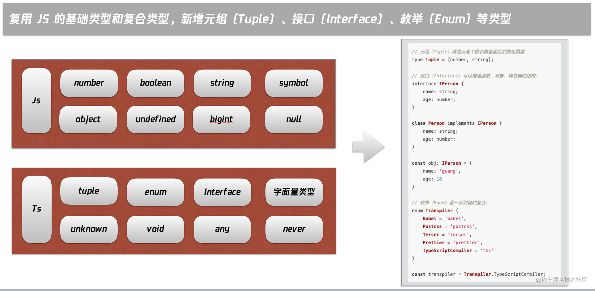
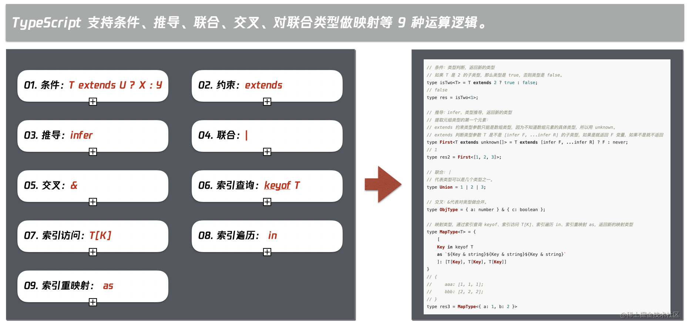
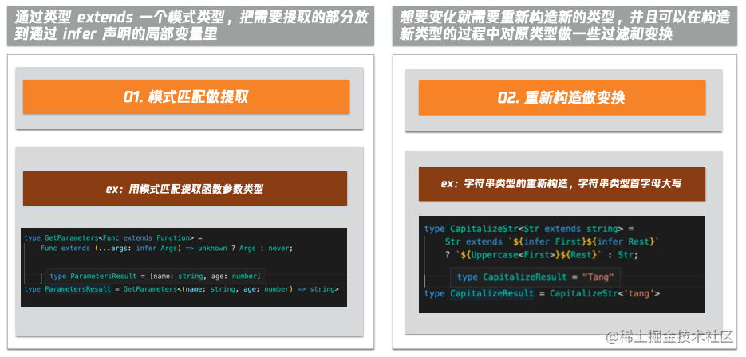
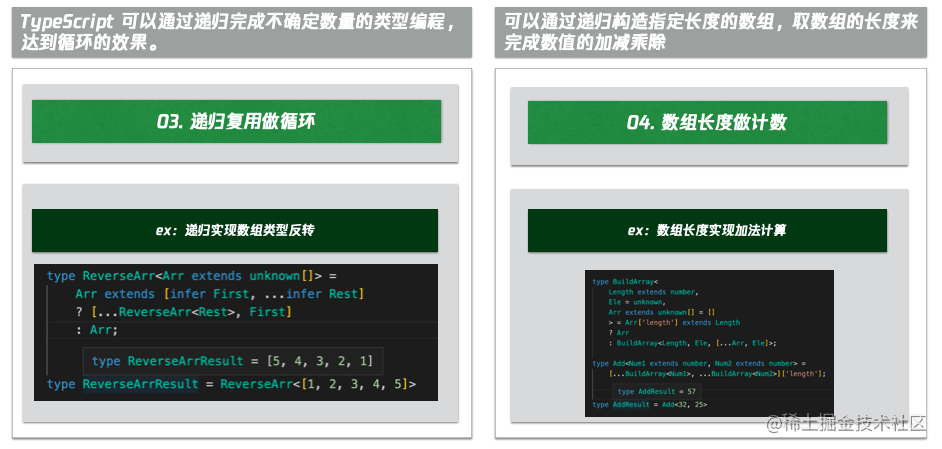
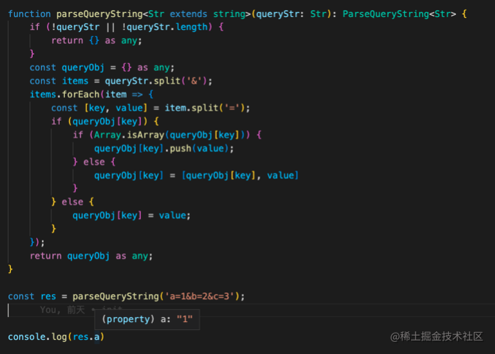

## TS 类型体操
### 1. 有哪些类型
类型体操的主要类型列举在图中。Typescript 复用了 JS 的基础类型和复合类型，并新增元组（Tuple）、接口（Interface）、枚举（Enum）等类型，这些类型在日常开发过程中类型声明应该都很常用，不做赘述。



### 2. 运算逻辑
TypeScript 支持条件、推导、联合、交叉、对联合类型做映射等 9 种运算逻辑。


- 条件：T extends U ? X : Y

条件判断和 js 逻辑相同，都是如果满足条件就返回 a 否则返回 b。
```ts
// 条件：extends ? :
// 如果 T 是 2 的子类型，那么类型是 true，否则类型是 false。
type isTwo<T> = T extends 2 ? true : false;
// false
type res = isTwo<1>;
```
- 约束：extends

通过约束语法 extends 限制类型。
```ts
// 通过 T extends Length 约束了 T 的类型，必须是包含 length 属性，且 length 的类型必须是 number。
interface Length {
    length: number
}

function fn1<T extends Length>(arg: T): number{
    return arg.length
}
```
- 推导：infer

推导则是类似 js 的正则匹配，都满足公式条件时，可以提取公式中的变量，直接返回或者再次加工都可以。
```ts
// 推导：infer
// 提取元组类型的第一个元素：
// extends 约束类型参数只能是数组类型，因为不知道数组元素的具体类型，所以用 unknown。
// extends 判断类型参数 T 是不是 [infer F, ...infer R] 的子类型，如果是就返回 F 变量，如果不是就不返回
type First<T extends unknown[]> = T extends [infer F, ...infer R] ? F : never;
// 1
type res2 = First<[1, 2, 3]>;
```
- 联合：|

联合代表可以是几个类型之一。
```ts
type Union = 1 | 2 | 3
```
- 交叉：&

交叉代表对类型做合并。
```ts
type ObjType = { a: number } & { c: boolean }
```
- 索引查询：keyof T

keyof 用于获取某种类型的所有键，其返回值是联合类型。
```ts
// const a: 'name' | 'age' = 'name'
const a: keyof {
    name: string,
    age: number
} = 'name'
```
- 索引访问：T[K]

T[K] 用于访问索引，得到索引对应的值的联合类型。
```ts
interface I3 {
  name: string,
  age: number
}

type T6 = I3[keyof I3] // string | number
```
- 索引遍历： in

in 用于遍历联合类型。
```ts
const obj = {
    name: 'tj',
    age: 11
}

type T5 = {
    [P in keyof typeof obj]: any
}

/*
{
  name: any,
  age: any
}
*/
```
- 索引重映射： as
as 用于修改映射类型的 key。
```ts
// 通过索引查询 keyof，索引访问 t[k]，索引遍历 in，索引重映射 as，返回全新的 key、value 构成的新的映射类型
type MapType<T> = {
    [
    Key in keyof T
    as `${Key & string}${Key & string}${Key & string}`
    ]: [T[Key], T[Key], T[Key]]
}
// {
//     aaa: [1, 1, 1];
//     bbb: [2, 2, 2];
// }
type res3 = MapType<{ a: 1, b: 2 }>
```
### 3. 运算套路
根据上面介绍的 9 种运算逻辑，我总结了 4 个类型套路。

- 模式匹配做提取；
- 重新构造做变换；
- 递归复用做循环；
- 数组长度做计数。

### 3.1 模式匹配做提取
第一个类型套路是模式匹配做提取。

模式匹配做提取的意思是通过类型 extends 一个模式类型，把需要提取的部分放到通过 infer 声明的局部变量里。

举个例子，用模式匹配提取函数参数类型。
```ts
type GetParameters<Func extends Function> =
    Func extends (...args: infer Args) => unknown ? Args : never;

type ParametersResult = GetParameters<(name: string, age: number) => string>
```
首先用 extends 限制类型参数必须是 Function 类型。

然后用 extends 为 参数类型匹配公式，当满足公式时，提取公式中的变量 Args。

实现函数参数类型的提取。
#### 3.2 重新构造做变换
第二个类型套路是重新构造做变换。

重新构造做变换的意思是想要变化就需要重新构造新的类型，并且可以在构造新类型的过程中对原类型做一些过滤和变换。

比如实现一个字符串类型的重新构造。
```ts
type CapitalizeStr<Str extends string> =
    Str extends `${infer First}${infer Rest}`
    ? `${Uppercase<First>}${Rest}` : Str;

type CapitalizeResult = CapitalizeStr<'tang'>
```
首先限制参数类型必须是字符串类型。

然后用 extends 为参数类型匹配公式，提取公式中的变量 First Rest，并通过 Uppercase 封装。

实现了首字母大写的字符串字面量类型。



#### 3.3 递归复用做循环
第三个类型套路是递归复用做循环。

Typescript 本身不支持循环，但是可以通过递归完成不确定数量的类型编程，达到循环的效果。

比如通过递归实现数组类型反转。
```ts
type ReverseArr<Arr extends unknown[]> =
    Arr extends [infer First, ...infer Rest]
    ? [...ReverseArr<Rest>, First]
    : Arr;
type ReverseArrResult = ReverseArr<[1, 2, 3, 4, 5]>
```
首先限制参数必须是数组类型。

然后用 extends 匹配公式，如果满足条件，则调用自身，否则直接返回。

实现了一个数组反转类型。


#### 3.4 数组长度做计数
第四个类型套路是数组长度做计数。

类型编程本身是不支持做加减乘除运算的，但是可以通过递归构造指定长度的数组，然后取数组长度的方式来完成数值的加减乘除。

比如通过数组长度实现类型编程的加法运算。
```ts
type BuildArray<
    Length extends number,
    Ele = unknown,
    Arr extends unknown[] = []
    > = Arr['length'] extends Length
    ? Arr
    : BuildArray<Length, Ele, [...Arr, Ele]>;

type Add<Num1 extends number, Num2 extends number> =
    [...BuildArray<Num1>, ...BuildArray<Num2>]['length'];


type AddResult = Add<32, 25>
```
首先通过递归创建一个可以生成任意长度的数组类型

然后创建一个加法类型，通过数组的长度来实现加法运算。



### 三、类型体操实践
分享的第三部分是类型体操实践。

前面分享了类型体操的概念及常用的运算逻辑。

下面我们就用这些运算逻辑来解析 Typescript 内置的高级类型。

1. 解析 Typescript 内置高级类型
- Partial 把索引变为可选

通过 in 操作符遍历索引，为所有索引添加 ？前缀实现把索引变为可选的新的映射类型。

```ts

type TPartial<T> = {
    [P in keyof T]?: T[P];
};

type PartialRes = TPartial<{ name: 'aa', age: 18 }>
```
- Required 把索引变为必选

通过 in 操作符遍历索引，为所有索引删除 ？前缀实现把索引变为必选的新的映射类型。
```ts
type TRequired<T> = {
    [P in keyof T]-?: T[P]
}

type RequiredRes = TRequired<{ name?: 'aa', age?: 18 }>
```
- Readonly 把索引变为只读

通过 in 操作符遍历索引，为所有索引添加 readonly 前缀实现把索引变为只读的新的映射类型。
```ts
type TReadonly<T> = {
    readonly [P in keyof T]: T[P]
}

type ReadonlyRes = TReadonly<{ name?: 'aa', age?: 18 }>
```
- Pick 保留过滤索引

首先限制第二个参数必须是对象的 key 值，然后通过 in 操作符遍历第二个参数，生成新的映射类型实现。
```ts
type TPick<T, K extends keyof T> = {
    [P in K]: T[P]
}

type PickRes = TPick<{ name?: 'aa', age?: 18 }, 'name'>
```
- Record 创建映射类型

通过 in 操作符遍历联合类型 K，创建新的映射类型。
```ts
type TRecord<K extends keyof any, T> = {
    [P in K]: T
}

type RecordRes = TRecord<'aa' | 'bb', string>
```
- Exclude 删除联合类型的一部分

通过 extends 操作符，判断参数 1 能否赋值给参数 2，如果可以则返回 never，以此删除联合类型的一部分。
```ts
type TExclude<T, U> = T extends U ? never : T

type ExcludeRes = TExclude<'aa' | 'bb', 'aa'>
```

- Extract 保留联合类型的一部分

和 Exclude 逻辑相反，判断参数 1 能否赋值给参数 2，如果不可以则返回 never，以此保留联合类型的一部分。
```ts
type TExtract<T, U> = T extends U ? T : never

type ExtractRes = TExtract<'aa' | 'bb', 'aa'>
```
- Omit 删除过滤索引

通过高级类型 Pick、Exclude 组合，删除过滤索引。
```ts
type TOmit<T, K extends keyof T> = Pick<T, Exclude<keyof T, K>>

type OmitRes = TOmit<{ name: 'aa', age: 18 }, 'name'>
```
- Awaited 用于获取 Promise 的 valueType

通过递归来获取未知层级的 Promise 的 value 类型。
```ts
type TAwaited<T> =
    T extends null | undefined
        ? T
        : T extends object & { then(onfulfilled: infer F): any }
            ? F extends ((value: infer V, ...args: any) => any)
                ? Awaited<V>
                : never
            : T;
type AwaitedRes = TAwaited<Promise<Promise<Promise<string>>>>
```
还有非常多高级类型，实现思路和上面介绍的类型套路大多一致，这里不一一赘述。

2. 解析 ParseQueryString 复杂类型
重点解析的是在背景章节介绍类型体操复杂度，举例说明的解析字符串参数的函数类型。

如图示 demo 所示，这个函数是用于将指定字符串格式解析为对象格式。
```ts
function parseQueryString1(queryStr) {
  if (!queryStr || !queryStr.length) {
    return {}
  }
  const queryObj = {}
  const items = queryStr.split('&')
  items.forEach((item) => {
    const [key, value] = item.split('=')
    if (queryObj[key]) {
      if (Array.isArray(queryObj[key])) {
        queryObj[key].push(value)
      } else {
        queryObj[key] = [queryObj[key], value]
      }
    } else {
      queryObj[key] = value
    }
  })
  return queryObj
}
```
比如获取字符串 a=1&b=2 中 a 的值。

常用的类型声明方式如下图所示：
```ts
function parseQueryString1(queryStr: string): Record<string, any> {
  if (!queryStr || !queryStr.length) {
    return {}
  }
  const queryObj = {}
  const items = queryStr.split('&')
  items.forEach((item) => {
    const [key, value] = item.split('=')
    if (queryObj[key]) {
      if (Array.isArray(queryObj[key])) {
        queryObj[key].push(value)
      } else {
        queryObj[key] = [queryObj[key], value]
      }
    } else {
      queryObj[key] = value
    }
  })
  return queryObj
}
```
参数类型为 string，返回类型为 Record<string, any>，这时看到，res1.a 类型为 any，那么有没有办法，准确的知道 a 的类型是字面量类型 1 呢？

下面就通过类型体操的方式，来重写解析字符串参数的函数类型。
```ts
type ParseParam<Param extends string> =
    Param extends `${infer Key}=${infer Value}`
        ? {
            [K in Key]: Value
        } : Record<string, any>;

type MergeParams<
    OneParam extends Record<string, any>,
    OtherParam extends Record<string, any>
> = {
  readonly [Key in keyof OneParam | keyof OtherParam]:
    Key extends keyof OneParam
        ? OneParam[Key]
        : Key extends keyof OtherParam
            ? OtherParam[Key]
            : never
}

type ParseQueryString<Str extends string> =
    Str extends `${infer Param}&${infer Rest}`
        ? MergeParams<ParseParam<Param>, ParseQueryString<Rest>>
        : ParseParam<Str>;
```
首先限制参数类型是 string 类型，然后为参数匹配公式 a&b，如果满足公式，将 a 解析为 key value 的映射类型，将 b 递归 ParseQueryString 类型，继续解析，直到不再满足 a&b 公式。

最后，就可以得到一个精准的函数返回类型，res.a = 1。



### 参考文档
- [一起来做类型体操](https://jelly.jd.com/article/631049513c3bd1006a1fd2b5)
