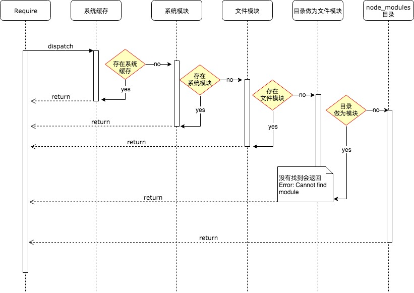

## 模块分类
 node 模块分为两类：
 1. 系统模块
 - C/C++ 模块，也叫 built-in 内建模块，一般用于 native 模块调用，再 require 出去
 - native 模块，在开发中使用的 Node.js 的 http、buffer、fs 等，底层也是调用的内建模块 (C/C++)。
 2. 第三方模块
 非 Node.js 自带的模块称为第三方模块，其实还分为路径形式的**文件模块**（以 .、..、/ 开头的）和**自定义的模块**（比如 express、koa 框架、moment.js 等）
- javaScript 模块：例如 hello.js
- json 模块：例如 hello.json
- C/C++ 模块：编译之后扩展名为 .node 的模块，例如 hello.node

## 模块加载机制
在 Node.js 中模块加载一般会经历 3 个步骤：`路径分析`、`文件定位`、`编译执行`。

按照模块的分类，按照以下顺序进行优先加载：

* **系统缓存**：模块被执行之后会会进行缓存，首先是先进行缓存加载，判断缓存中是否有值。
* **系统模块**：也就是原生模块，这个优先级仅次于缓存加载，部分核心模块已经被编译成二进制，省略了 ```路径分析```、```文件定位```，直接加载到了内存中，系统模块定义在 Node.js 源码的 lib 目录下，可以去查看。
* **文件模块**：优先加载 ```.```、```..```、```/``` 开头的，如果文件没有加上扩展名，会依次按照 ```.js```、```.json```、```.node``` 进行扩展名补足尝试，那么**在尝试的过程中也是以同步阻塞模式来判断文件是否存在**，从性能优化的角度来看待，```.json```、```.node```最好还是加上文件的扩展名。
* **目录做为模块**：这种情况发生在文件模块加载过程中也没有找到，但是发现是一个目录的情况，这个时候会将这个目录当作一个 ```包``` 来处理，Node 这块采用了 Commonjs 规范，先会在项目根目录查找 package.json 文件，取出文件中定义的 main 属性 ```("main": "lib/hello.js")``` 描述的入口文件进行加载，也没加载到，则会抛出默认错误: Error: Cannot find module 'lib/hello.js'
* **node_modules 目录加载**：对于系统模块、路径文件模块都找不到，Node.js 会从当前模块的父目录进行查找，直到系统的根目录


> 模块缓存在哪

Node.js 提供了 require.cache API 查看已缓存的模块，返回值为对象；

> 模块循环引用
```js
// a.js
console.log('a模块start');

exports.test = 1;

undeclaredVariable = 'a模块未声明变量'

const b = require('./b');

exports.test2 = 2;
console.log('a模块加载完毕: b.test值：',b.test);
```

```js
// b.js
console.log('b模块start');

exports.test = 2;

const a = require('./a');

console.log('undeclaredVariable: ', undeclaredVariable);

console.log('b模块加载完毕: a.test值：', a.test, a.test2);
```
> 1. 假设有 a.js、b.js 两个模块相互引用，会有什么问题？是否为陷入死循环？看以下例子
> 2. a 模块中的 undeclaredVariable 变量在 b.js 中是否会被打印？

控制台执行```node a.js```，查看输出结果：

```
a模块start
b模块start
undeclaredVariable:  a模块未声明变量
b模块加载完毕: a.test值： 1 undefined
a模块加载完毕: b.test值： 2
```

问题1，启动 ```a.js``` 的时候，会加载 ```b.js```，那么在 ```b.js``` 中又加载了 ```a.js```，但是此时 ```a.js``` 模块还没有执行完，返回的是一个 ```a.js``` 模块的 ```exports``` 对象 ```未完成的副本```（a模块此时只解析到了 `const b = require('./b');` 这行， 所以b模块只能拿到这行之前到处的内容） 给到 ```b.js``` 模块（因此是不会陷入死循环的）。然后 ```b.js``` 完成加载之后将 ```exports``` 对象提供给了 ```a.js``` 模块；

问题2，因为 ```undeclaredVariable``` 是一个未声明的变量，也就是一个挂在全局的变量，那么在其他地方当然是可以拿到的。

在执行代码之前，Node.js 会使用一个代码封装器进行封装，例如下面所示：

```js
(function(exports, require, module, __filename, __dirname) {
// 模块的代码
});
```
## 对象引用关系考察

> 也许是面试考察最多的问题：module.exports 与 exports 的区别？

exports 相当于 module.exports 的快捷方式如下所示:

```js
const exports = modules.exports;
```

但是要注意不能改变 exports 的指向，我们可以通过 ``` exports.test = 'a' ``` 这样来导出一个对象, 但是不能像下面示例直接赋值，这样会改变 exports 的指向

```js
// 错误的写法 将会得到 undefined
exports = {
  'a': 1,
  'b': 2
}

// 正确的写法
modules.exports = {
  'a': 1,
  'b': 2
}
```

更好的理解之间的关系，可以参考 [JavaScript中的对象引用](/javascript/object.md#对象引用传递)


