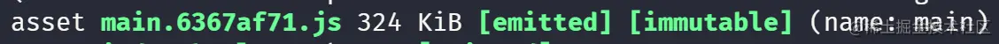

## 一、前言
在默认的配置情况下，我们知道，webpack 会把所有代码打包到一个 chunk 中，举个例子当你的一个单页面应用很大的时候，你可能就需要将每个路由拆分到一个 chunk 中，这样才方便我们实现按需加载。

代码分离是 webpack 中最引人注目的特性之一。此特性能够把代码分离到不同的 bundle 中，然后可以按需加载或并行加载这些文件。代码分离可以用于获取更小的 bundle，以及控制资源加载优先级，如果使用合理，会极大影响加载时间。


## 二、关于代码分割
接下来我们会分别分析不同的代码分隔方式带来的打包差异，首先我们的项目假设有这两个简单的文件👇
index.js
```js
import { mul } from './test'
import $ from 'jquery'

console.log($)
console.log(mul(2, 3))
```
test.js
```js
import $ from 'jquery'

console.log($)

function mul(a, b) {
    return a * b
}

export { mul }
```
可以看到现在他们二者都依赖于 jquery 这个库，并且相互之间也会有依赖。


当我们在默认配置的情况下进行打包，结果是这样的👇，会把所有内容打包进一个 main bundle 内（324kb）



那么我们如何用最直接的方式从这个 bundle 中分离出其他模块呢？
### 1. 多入口
webpack 配置中的 *entry* ，可以设置为多个，也就是说我们可以分别将 index 和 test 文件分别作为入口：
```js
// entry: './src/index.js', 原来的单入口
/** 现在分别将它们作为入口 */
entry:{
  index:'./src/index.js',
  test:'./src/test.js'
},
output: {
  filename: '[name].[hash:8].js',
  path: path.resolve(__dirname, './dist'),
},
```
这样让我们看一下这样打包后的结果：


确实打包出了两个文件！但是为什么两个文件都有 *320+kb* 呢？不是说好拆分获取更小的 bundle ？这是因为由于二者都引入了 jquery 而 webpack 从两次入口进行打包分析的时候会每次都将依赖的模块分别打包进去👇


没错，这种配置的方式确实会带来一些*隐患*以及不便：

- **如果入口 chunk 之间包含一些重复的模块，那些重复模块都会被引入到各个 bundle 中。**
- **这种方法不够灵活，并且不能动态地将核心应用程序逻辑中的代码拆分出来。**

那么有没有方式可以既可以将共同依赖的模块进行打包分离，又不用进行繁琐的手动配置入口的方式呢？那必然是有的。
### 2. SplitChunksPlugin
**SplitChunks** 是 webpack4 开始*自带的开箱即用*的一个插件，他可以将满足规则的 chunk 进行分离，也可以自定义配置。在 webpack4 中用它取代了之前用来解决重复依赖的 **CommonsChunkPlugin** 。
让我们在我们的 webpack 配置中加上一些配置：
```js
entry: './src/index.js', // 这里我们改回单入口
/** 加上如下设置 */
optimization: {
  splitChunks: {
    chunks: 'all',
  },
},
```

打包后的结果如图：


可以看到很明显除了根据入口打包出的 main bundle 之外，还多出了一个名为 *vendors-node_modules_jquery_dist_jquery_js.xxxxx.js* ，显然这样我们将公用的 jquery 模块就提取出来了。
接下来我们来探究一下 *SplitChunksPlugin* 。
首先看下配置的默认值：
```javascript
splitChunks: {
    // 表示选择哪些 chunks 进行分割，可选值有：async，initial 和 all
    chunks: "async",
    // 表示新分离出的 chunk 必须大于等于 minSize，20000，约 20kb。
    minSize: 20000,
    // 通过确保拆分后剩余的最小 chunk 体积超过限制来避免大小为零的模块,仅在剩余单个 chunk 时生效
    minRemainingSize: 0,
    // 表示一个模块至少应被 minChunks 个 chunk 所包含才能分割。默认为 1。
    minChunks: 1,
    // 表示按需加载文件时，并行请求的最大数目。
    maxAsyncRequests: 30,
    // 表示加载入口文件时，并行请求的最大数目。
    maxInitialRequests: 30,
    // 强制执行拆分的体积阈值和其他限制（minRemainingSize，maxAsyncRequests，maxInitialRequests）将被忽略
    enforceSizeThreshold: 50000,
    // cacheGroups 下可以可以配置多个组，每个组根据 test 设置条件，符合 test 条件的模块，就分配到该组。模块可以被多个组引用，但最终会根据 priority 来决定打包到哪个组中。默认将所有来自 node_modules 目录的模块打包至 vendors 组，将两个以上的 chunk 所共享的模块打包至 default 组。
    cacheGroups: {
        defaultVendors: {
            test: /[\\/]node_modules[\\/]/,
            // 一个模块可以属于多个缓存组。优化将优先考虑具有更高 priority（优先级）的缓存组。
            priority: -10,
            // 如果当前 chunk 包含已从主 bundle 中拆分出的模块，则它将被重用
            reuseExistingChunk: true,
        },
   		  default: {
            minChunks: 2,
            priority: -20,
            reuseExistingChunk: true
        }
    }
}
```
默认情况下，SplitChunks 只会对异步调用的模块进行分割（*chunks: "async"*），并且默认情况下处理的 chunk 至少要有 20kb ，过小的模块不会被包含进去。

补充一下，默认值会根据 mode 的配置不同有所变化，具体参见[源码](https://github.com/webpack/webpack/blob/HEAD/lib/config/defaults.js)👇：
```js
const { splitChunks } = optimization;
if (splitChunks) {
  A(splitChunks, "defaultSizeTypes", () => ["javascript", "unknown"]);
  D(splitChunks, "hidePathInfo", production);
  D(splitChunks, "chunks", "async");
  D(splitChunks, "usedExports", optimization.usedExports === true);
  D(splitChunks, "minChunks", 1);
  F(splitChunks, "minSize", () => (production ? 20000 : 10000));
  F(splitChunks, "minRemainingSize", () => (development ? 0 : undefined));
  F(splitChunks, "enforceSizeThreshold", () => (production ? 50000 : 30000));
  F(splitChunks, "maxAsyncRequests", () => (production ? 30 : Infinity));
  F(splitChunks, "maxInitialRequests", () => (production ? 30 : Infinity));
  D(splitChunks, "automaticNameDelimiter", "-");
  const { cacheGroups } = splitChunks;
  F(cacheGroups, "default", () => ({
    idHint: "",
    reuseExistingChunk: true,
    minChunks: 2,
    priority: -20
  }));
  F(cacheGroups, "defaultVendors", () => ({
    idHint: "vendors",
    reuseExistingChunk: true,
    test: NODE_MODULES_REGEXP,
    priority: -10
  }));
}
```
*cacheGroups* **缓存组**是施行分割的重中之重，他可以使用来自 splitChunks.* 的**任何选项**，但是 **test、priority 和 reuseExistingChunk** 只能在缓存组级别上进行配置。默认配置中已经给我们提供了 Vendors 组和一个 defalut 组，**Vendors**组中使用 `test: /[\\/]node_modules[\\/]/` 匹配了 node_modules 中的所有符合规则的模块。

> Tip：当 webpack 处理文件路径时，它们始终包含 Unix 系统中的 / 和 Windows 系统中的 \。这就是为什么在 {cacheGroup}.test 字段中使用 \[\\\\/\] 来表示路径分隔符的原因。{cacheGroup}.test 中的 / 或 \ 会在跨平台使用时产生问题。

综上的配置，我们便可以理解为什么我们在打包中会产生出名为 `vendors-node_modules_jquery_dist_jquery_js.db47cc72.js` 的文件了。如果你想要对名称进行自定义的话，也可以使用 `splitChunks.name` 属性（每个 cacheGroup 中都可以使用），这个属性支持使用三种形式：

1. *boolean = false* 设为 false 将保持 chunk 的相同名称，因此不会不必要地更改名称。这是生产环境下构建的建议值。
2. *function (module, chunks, cacheGroupKey) => string* 返回值要求是 string 类型，并且在 *chunks* 数组中每一个 chunk 都有 *chunk.name* 和 *chunk.hash* 属性，举个例子 👇
```js
name(module, chunks, cacheGroupKey) {
  const moduleFileName = module
  .identifier()
  .split('/')
  .reduceRight((item) => item);
  const allChunksNames = chunks.map((item) => item.name).join('~');
  return `${cacheGroupKey}-${allChunksNames}-${moduleFileName}`;
},
```

3. *string* 指定字符串或始终返回相同字符串的函数会将所有常见模块和 vendor 合并为一个 chunk。这可能会导致**更大的初始下载量并减慢页面加载速度**。

另外注意一下 *splitChunks.maxAsyncRequests* 和 *splitChunks.maxInitialRequests* 分别指的是**按需加载时最大的并行请求数**和**页面初始渲染时候需要的最大并行请求数**
在我们的项目较大时，如果需要对某个依赖单独拆包的话，可以进行这样的配置：
```js
cacheGroups: {
  react: {
    name: 'react',
      test: /[\\/]node_modules[\\/](react)/,
      chunks: 'all',
      priority: -5,
  },
 },
```
这样打包后就可以拆分指定的包：


更多配置详见[官网配置文档](https://webpack.js.org/plugins/split-chunks-plugin/)
### 3. 动态 import
使用 [import()]() 语法 来实现动态导入也是我们非常推荐的一种代码分割的方式，我们先来简单修改一下我们的 `index.js` ，再来看一下使用后打包的效果：
```js
// import { mul } from './test'
import $ from 'jquery'

import('./test').then(({ mul }) => {
    console.log(mul(2,3))
})

console.log($)
// console.log(mul(2, 3))
```
可以看到，通过 *import()* 语法导入的模块在打包时会自动单独进行打包

值得注意的是，这种语法还有一种很方便的“动态引用”的方式，他可以加入一些适当的表达式，举个例子，假设我们需要加载适当的主题：
```js
const themeType = getUserTheme();
import(`./themes/${themeType}`).then((module) => {
  // do sth aboout theme
});
```
这样我们就可以“动态”加载我们需要的异步模块，实现的原理主要在于两点：

1. 至少需要**包含模块相关的路径信息**，打包可以限定于一个特定的目录或文件集。
2. 根据路径信息 webpack 在打包时会把 ./themes  中的所有文件打包进新的 chunk 中，以便需要时使用到。

### 4. 魔术注释
在上述的 *import()* 语法中，我们会发现打包自动生成的文件名并不是我们想要的，我们如何才能自己控制打包的名称呢？这里就要引入我们的魔术注释（Magic Comments）：
```js
import(/* webpackChunkName: "my-chunk-name" */'./test')
```
通过这样打包出来的文件：

魔术注释不仅仅可以帮我们修改 chunk 名这么简单，他还可以实现譬如预加载等功能，这里举个例子：
我们通过希望在点击按钮时才加载我们需要的模块功能，代码可以这样：
```js
// index.js
document.querySelector('#btn').onclick = function () {
  import('./test').then(({ mul }) => {
    console.log(mul(2, 3));
  });
};
```
```js
//test.js
function mul(a, b) {
  return a * b;
}
console.log('test 被加载了');
export { mul };
```

可以看到，在我们点击按钮的同时确实加载了 *test.js* 的文件资源。但是如果这个模块是一个很大的模块，在点击时进行加载可能会造成长时间 loading 等用户体验不是很好的效果，这个时候我们可以使用我们的 `/* webpackPrefetch: true */` 方式进行**预获取**，来看下效果：
```js
// index,js

document.querySelector('#btn').onclick = function () {
  import(/* webpackPrefetch: true */'./test').then(({ mul }) => {
    console.log(mul(2, 3));
  });
};
```

可以看到整个过程中，在画面初始加载的时候，*test.js* 的资源就已经被预先加载了，而在我们点击按钮时，会从 *(prefetch cache)* 中读取内容。这就是模块预获取的过程。另外我们还有 */* webpackPreload: true */* 的方式进行预加载。
但是 prefetch 和 preload 听起来感觉差不多，实际上他们的加载时机等是完全不同的：

1. preload chunk 会在父 chunk 加载时，以并行方式开始加载。prefetch chunk 会在父 chunk 加载结束后开始加载。
2. preload chunk 具有中等优先级，并立即下载。prefetch chunk 在浏览器闲置时下载。
3. preload chunk 会在父 chunk 中立即请求，用于当下时刻。prefetch chunk 会用于未来的某个时刻。

## 三、结尾
在最初有工程化打包思想时，我们会考虑将多文件打包到一个文件内减少多次的资源请求，随着项目的越来越复杂，做项目优化时，我们发现项目加载越久用户体验就越不好，于是又可以通过代码分割的方式去减少页面初加载时的请求过大的资源体积。
本文中仅简单介绍了常用的 webpack 代码分割方式，但是在实际的项目中进行性能优化时，往往会有更加严苛的要求，希望可以通过本文的介绍让大家快速了解上手代码分割的技巧与优势。
