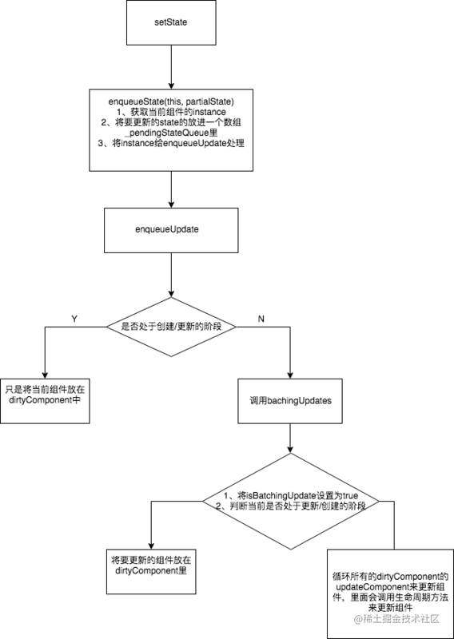

setState被调用之后，更新组件的过程，下面是一个简单的流程图。



下面来逐步的解析图里的流程。

### 一、setState
**ReactBaseClassses.js**
```js
ReactComponent.prototype.setState = function (partialState, callback) {
  //  将setState事务放进队列中
  this.updater.enqueueSetState(this, partialState);
  if (callback) {
    this.updater.enqueueCallback(this, callback, 'setState');
  }
};
```

这里的partialState可以传object,也可以传function,它会产生新的state以一种`Object.assgine()`的方式跟旧的state进行合并。

### 二、enqueueSetState
```js
enqueueSetState: function (publicInstance, partialState) {
    // 获取当前组件的instance
  var internalInstance = getInternalInstanceReadyForUpdate(publicInstance, 'setState');

    // 将要更新的state放入一个数组里
    var queue = internalInstance._pendingStateQueue || (internalInstance._pendingStateQueue = []);
  queue.push(partialState);

    //  将要更新的component instance也放在一个队列里
  enqueueUpdate(internalInstance);
}
```
这段代码可以得知，`enqueueSetState` 做了两件事： 
1. 将新的`state`放进数组里 
2. 用`enqueueUpdate`来处理将要更新的实例对象

### 三、enqueueUpdate

**ReactUpdates.js**
```js
function enqueueUpdate(component) {
  // 如果没有处于批量创建/更新组件的阶段，则处理update state事务
  if (!batchingStrategy.isBatchingUpdates) {
    batchingStrategy.batchedUpdates(enqueueUpdate, component);
    return;
  }
  // 如果正处于批量创建/更新组件的过程，将当前的组件放在dirtyComponents数组中
  dirtyComponents.push(component);
}
```
由这段代码可以看到，当前如果正处于**创建/更新组件**的过程，就不会立刻去更新组件，而是先把当前的组件放在`dirtyComponent`里，所以不是每一次的setState都会更新组件~。

这段代码就解释了我们常常听说的：**setState是一个异步的过程，它会集齐一批需要更新的组件然后一起更新。**

而 `batchingStrategy` 又是个什么东西呢？

### 四、batchingStrategy
**ReactDefaultBatchingStrategy.js**
```js
var ReactDefaultBatchingStrategy = {
  // 用于标记当前是否出于批量更新
  isBatchingUpdates: false,
  // 当调用这个方法时，正式开始批量更新
  batchedUpdates: function (callback, a, b, c, d, e) {
    var alreadyBatchingUpdates = ReactDefaultBatchingStrategy.isBatchingUpdates;

    ReactDefaultBatchingStrategy.isBatchingUpdates = true;

    // 如果当前事务正在更新过程在中，则调用callback，既enqueueUpdate
    if (alreadyBatchingUpdates) {
      return callback(a, b, c, d, e);
    } else {
    // 否则执行更新事务
      return transaction.perform(callback, null, a, b, c, d, e);
    }
  }
};
```

这里注意两点： 
  1. 如果**当前事务正在更新过程中**，则使用 `enqueueUpdate` 将当前组件放在 `dirtyComponent` 里。
  2. 如果当前不在更新过程的话，则执行更新事务。

### 五、transaction

```
/**
 * <pre>
 *                       wrappers (injected at creation time)
 *                                      +        +
 *                                      |        |
 *                    +-----------------|--------|--------------+
 *                    |                 v        |              |
 *                    |      +---------------+   |              |
 *                    |   +--|    wrapper1   |---|----+         |
 *                    |   |  +---------------+   v    |         |
 *                    |   |          +-------------+  |         |
 *                    |   |     +----|   wrapper2  |--------+   |
 *                    |   |     |    +-------------+  |     |   |
 *                    |   |     |                     |     |   |
 *                    |   v     v                     v     v   | wrapper
 *                    | +---+ +---+   +---------+   +---+ +---+ | invariants
 * perform(anyMethod) | |   | |   |   |         |   |   | |   | | maintained
 * +----------------->|-|---|-|---|-->|anyMethod|---|---|-|---|-|-------->
 *                    | |   | |   |   |         |   |   | |   | |
 *                    | |   | |   |   |         |   |   | |   | |
 *                    | |   | |   |   |         |   |   | |   | |
 *                    | +---+ +---+   +---------+   +---+ +---+ |
 *                    |  initialize                    close    |
 *                    +-----------------------------------------+
 * </pre>
 */
```

简单说明一下`transaction`对象，它暴露了一个`perform`的方法，用来执行`anyMethod`，在`anyMethod`执行的前，需要先执行所有`wrapper`的`initialize`方法，在执行完后，要执行所有`wrapper`的`close`方法，就辣么简单。

在ReactDefaultBatchingStrategy.js，tranction 的 wrapper有两个 `FLUSH_BATCHED_UPDATES`, `RESET_BATCHED_UPDATES`
```js
var RESET_BATCHED_UPDATES = {
  initialize: emptyFunction,
  close: function () {
    ReactDefaultBatchingStrategy.isBatchingUpdates = false;
  }
};

var FLUSH_BATCHED_UPDATES = {
  initialize: emptyFunction,
  close: ReactUpdates.flushBatchedUpdates.bind(ReactUpdates)
};

var TRANSACTION_WRAPPERS = [FLUSH_BATCHED_UPDATES, RESET_BATCHED_UPDATES];
```

可以看到，这两个wrapper的`initialize`都没有做什么事情，但是在callback执行完之后，`RESET_BATCHED_UPDATES` 的作用是将`isBatchingUpdates`置为`false`， `FLUSH_BATCHED_UPDATES` 的作用是执行`flushBatchedUpdates`，然后里面会循环所有`dirtyComponent`，调用`updateComponent`来执行所有的生命周期方法，`componentWillReceiveProps`， `shouldComponentUpdate`， `componentWillUpdate`， `render`， `componentDidUpdate` 最后实现组件的更新。以上即为`setState`的实现过程，最后还是用一个流程图在做一个总结吧~


