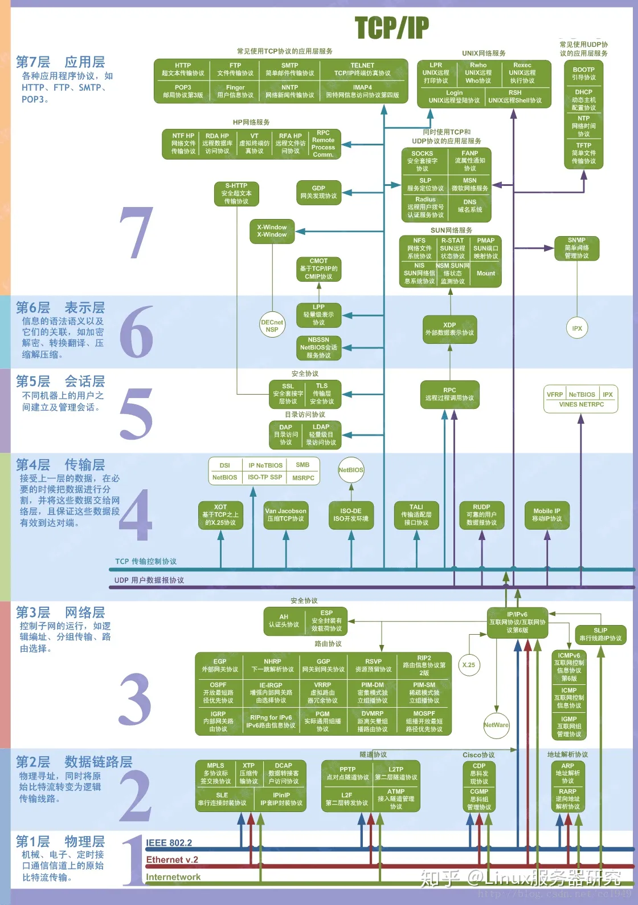
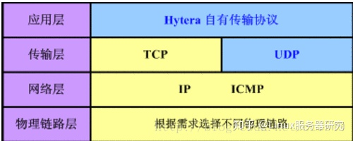
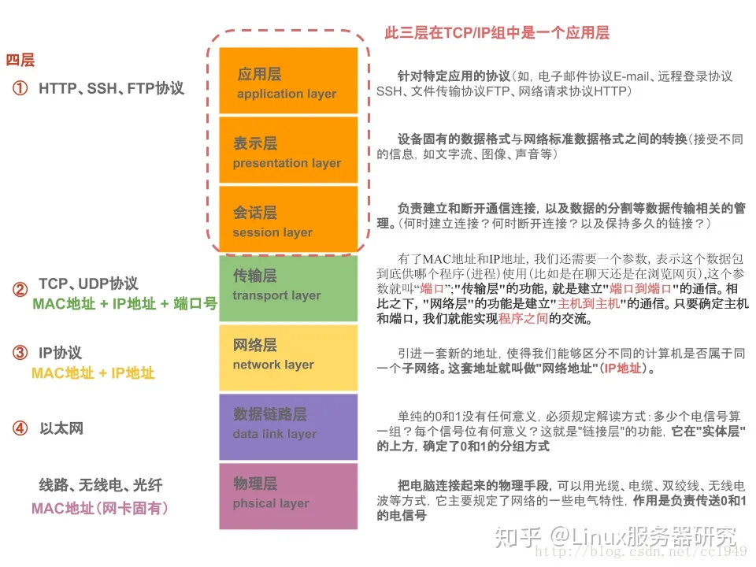
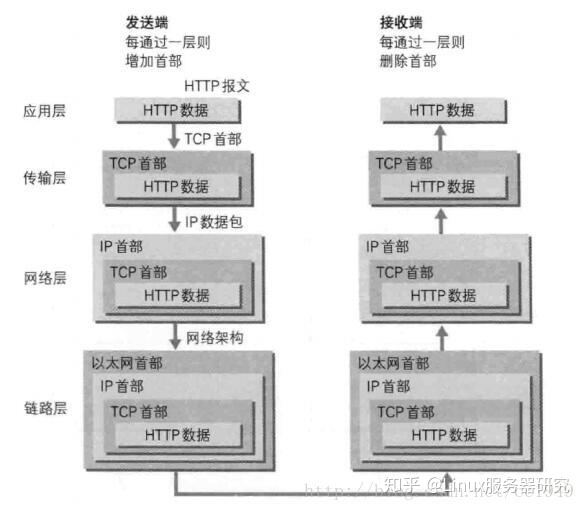

## 1. OSI 七层模型
OSI是Open System Interconnect的缩写，意为开放式系统互联。

**应表会传网数物**
7层是指OSI七层协议模型，主要是：`应用层（Application）`、`表示层（Presentation）`、`会话层（Session）`、`传输层（Transport）`、`网络层（Network）`、`数据链路层（Data Link）`、`物理层（Physical）`。

## 2. TCP/IP四层模型
4层是指TCP/IP四层模型，主要包括：应用层、运输层、网际层和网络接口层。

4层协议和对应的标准7层协议的关系如下图：

从上往下，每经过一层，协议就会在数据包包头上面做点手脚，加点东西，传送到接收端，再层层解套出来，如下示意图：

## 3. TCP和UDP的区别

1、基于连接与无连接；
> TCP 是面向连接的协议，在收发数据前必须和对方建立可靠的连接，一个TCP连接必须要经过三次“对话”才能建立起来；
> UDP 是一个非连接的协议，传输数据之前源端和终端不建立连接， 当它想传送时就简单地去抓取来自应用程序的数据，并尽可能快地把它扔到网络上。 在发送端，UDP传送数据的速度仅仅是受应用程序生成数据的速度、 计算机的能力和传输带宽的限制； 在接收端，UDP把每个消息段放在队列中，应用程序每次从队列中读一个消息段。

2、对系统资源的要求（TCP较多，UDP少）；

3、UDP程序结构较简单；

4、流模式与数据报模式 ；
> udp面向数据报，每次传输都是一个一个数据包交付，不合并也不拆分，向下向上只是加首部和去首部的区别；
> tcp是面向字节流的，简单说就是，应用程序和tcp交互每次一个数据块，但tcp只把这些看做是字节流，它不保证接受方收到的数据快的大小和发送方一样，比如发送方发了10个数据块给tcp但是但接收方的tcp可能只用了5个数据块就把收到的字节流交付给自己上方的应用程序了。
> 总：只保证字节流大小一致，不保证数据块。因为tcp发送时要考虑对方给出的窗口值和网络拥塞情况界定发送的块的大小，言简意赅就是：大了我分块发送，少了我可以累积在一起在发送。保证你接收方收到的字节流和发送方发出的字节流一样就行。
5、TCP保证数据正确性，UDP可能丢包；

6、TCP保证数据顺序，UDP不保证。